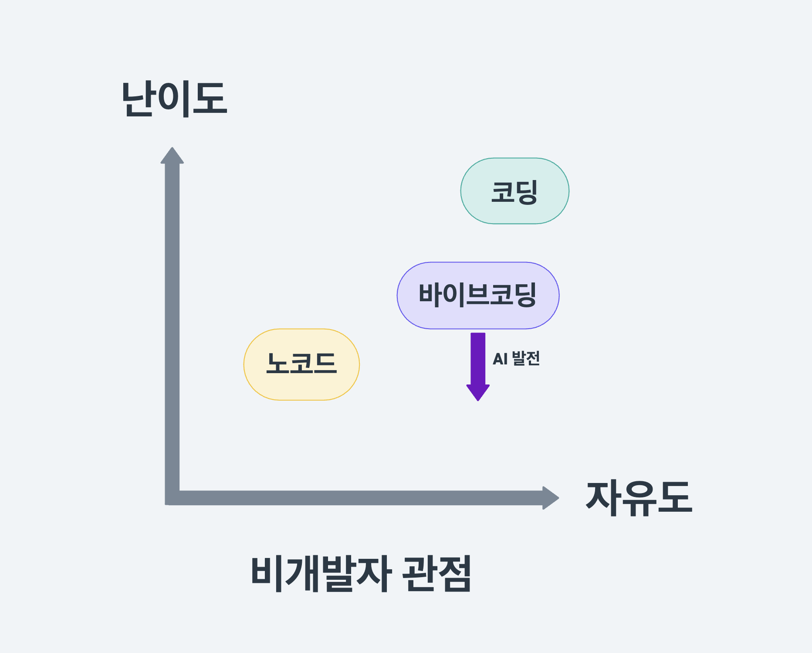
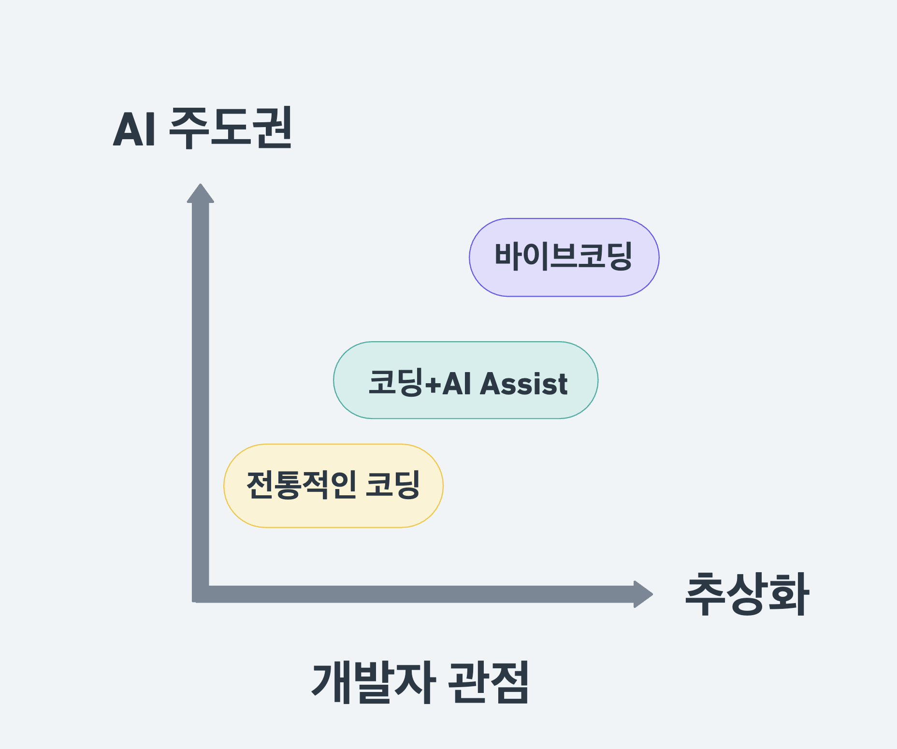

# Replit으로 바이브코딩 마스터하기 🚀


**바이브코딩(Vibe Coding)** 이란 코드를 직접 작성하는 대신 AI에게 프롬프트로 요청해서 코드를 완성시키는 새로운 코딩 방식입니다. 이 가이드는 Replit을 활용하여 체계적으로 바이브코딩을 하는 방법을 알려드립니다.

## 📋 목차

- [바이브코딩이란?](#바이브코딩이란)
- [Replit을 선택하는 이유](#replit을-선택하는-이유)
- [시작하기](#시작하기)
- [바이브코딩 프레임워크](#바이브코딩-프레임워크)
- [실전 프로젝트: 퍼스널 브랜딩 웹사이트 제작](#실전-프로젝트-퍼스널-브랜딩-웹사이트-제작)
- [배포하기](#배포하기)
- [팁과 노하우](#팁과-노하우)
- [FAQ](#faq)

## 바이브코딩이란?

### 비개발자에게는



- **노코드툴의 대체재**: 기존 노코드툴보다 높은 자유도 제공
- **낮은 진입장벽**: 코딩 직접하지 않아도 코드 작성 가능
- **무제한 창작**: 템플릿에 제약받지 않는 자유로운 개발

### 개발자에게는



- **개발 패러다임의 전환**: 코드 작성자에서 설계자 역할로 진화
- **생산성 극대화**: 반복 작업 최소화, 창의적 설계에 집중
- **추상화된 개발**: 의도 전달이 핵심이 되는 새로운 개발 방식

## Replit을 선택하는 이유

### ✨ 주요 장점
- **즉시 시작**: 회원가입만으로 바로 바이브코딩 시작 가능
- **통합 환경**: 개발, 테스트, 배포가 모두 한 곳에서
- **협업 친화적**: 구글 독스처럼 실시간 공유 및 협업
- **원클릭 배포**: 복잡한 배포 과정을 클릭 한 번으로 해결

### 💰 가격 정보
- **무료 버전**: 테스트 및 간단한 프로젝트용
- **Core 버전**: 본격적인 바이브코딩용
  - 연간 결제: $20/월
  - 월간 결제: $25/월
  - 첫 결제 $10 할인 쿠폰(업로드 시점 기준): `vip10` (월간) / `vip10y` (연간)

## 시작하기

### 1. 회원가입 및 초기 설정
1. [Replit](https://replit.com/refer/citizendev9c) 접속 ($10 크레딧 추가 혜택 리퍼럴 링크)
2. 회원가입 및 로그인
3. 새 프로젝트 생성
4. Agent 모드 선택

### 2. 첫 번째 프롬프트
```
나는 [당신의 분야/전문성]에 대한 웹사이트를 만들고 싶어
```

## 바이브코딩 프레임워크

### 🎯 설계자 마인드셋
단순히 위와 같이 AI에게 모든 것을 맡기는 대신, **우리가 설계자가 되어 AI를 코드 작성자로 고용**하는 접근법

### 📝 3단계 사전 계획

#### 1. 문제 정의
- **해결하고 싶은 문제**: 무엇을 위한 웹사이트/앱인가?
- **목표**: 브랜드 가치 전달, 사업 기회 확보 등

#### 2. 접근 방법
- **구조 설계**: 사이트맵 > 스타일 가이드 > 핵심 기능 > 부가 기능
- **우선순위**: 핵심 기능과 부가 기능 분리

#### 3. 필요 기능
- **필수 구성요소**: 반드시 포함되어야 할 내용
- **기능 요구사항**: 구현해야 할 기능들
- **디자인 방향**: 스타일 가이드나 참고 사이트

## 실전 프로젝트: 퍼스널 브랜딩 웹사이트 제작

### 📋 프로젝트 개요
개인 브랜딩을 위한 멀티페이지 웹사이트를 단계별로 제작합니다.

### 🏗️ 1단계: 웹사이트 뼈대 생성

```markdown
나는 [당신의 전문 분야]에 대한 콘텐츠를 제공하는 퍼스널 브랜딩 웹사이트를 제작해줘. 
[당신의 미션과 목표]를 전달하고 사업기회를 확보할 수 있는 웹사이트로 만들어줘.

먼저, 퍼스널 브랜딩 웹사이트의 기본 구조를 만들어줘. 멀티페이지 웹사이트로 제작해줘.

사이트 맵:
- 홈 (Home): 메인 랜딩 페이지
- 소개 (About): 나에 대한 상세 정보
- [서비스/포트폴리오]: 주요 콘텐츠나 서비스 소개
- 블로그: 블로그 글 모음
- 사업 문의: 연락처 및 문의 양식

기술 스택:
- React 프레임워크 사용
- 반응형 웹 디자인 적용

기본 구조를 잡아주고, 각 페이지의 기본 레이아웃과 네비게이션이 작동하는 상태로 구현해줘. 
현재는 스타일보다 구조에 집중해줘. 

각 페이지는 비어있는 상태로 구성하고, 나중에 내용을 추가할 수 있도록 컴포넌트 구조를 잘 설계해줘.
```

### 📝 2단계: 웹사이트 내용 업데이트

```markdown
이제 profile.md 파일의 내용을 사이트에 반영해줘.

profile.md 파일을 읽어서:
- 홈 페이지에는 간략한 소개, 주요 경력, 핵심 메시지를 반영해줘
- 소개 페이지에는 상세 경력, 스킬, 나의 비전과 미션 등 더 자세한 정보를 반영해줘
- 사업 문의 페이지에는 내 연락처, 소셜 미디어 등을 반영해줘

각 페이지에 내용을 적절히 배치하고, 사용자가 쉽게 정보를 파악할 수 있도록 구성해줘. 
Markdown 형식의 내용을 적절히 HTML로 변환하여 표시해줘.
```

**필요한 파일**: `profile.md`
```markdown
# [당신의 이름]

## 소개
[당신의 간단한 소개]

## 경력
- [주요 경력 1]
- [주요 경력 2]
- [주요 경력 3]

## 전문 분야
- [전문 분야 1]
- [전문 분야 2]
- [전문 분야 3]

## 미션
[당신의 미션과 비전]

## 연락처
- 이메일: [your-email@example.com]
- 웹사이트: [your-website.com]
- 소셜미디어: [your-social-media]
```

### 🎨 3단계: 스타일 적용

```markdown
이제 style-guide.md 파일을 참고하여 웹사이트에 디자인을 적용해줘.

style-guide.md 파일에 명시된:
- 색상 팔레트
- 폰트 스타일 및 크기
- 레이아웃 가이드라인
- 버튼 및 UI 요소 스타일

이 모든 요소를 웹사이트에 일관되게 적용해줘. 모든 페이지에 동일한 디자인 시스템이 적용되도록 해줘.
반응형 디자인을 적용해서 모바일, 태블릿, 데스크탑에서 모두 잘 보이도록 해줘.
```

**필요한 파일**: `style-guide.md`
```markdown
# 스타일 가이드

## 색상 팔레트
- Primary: #[색상코드]
- Secondary: #[색상코드]
- Accent: #[색상코드]
- Background: #[색상코드]
- Text: #[색상코드]

## 폰트
- 헤더: [폰트명], [크기]
- 본문: [폰트명], [크기]
- 강조: [폰트명], [크기]

## 레이아웃
- 최대 너비: [수치]px
- 여백: [수치]px
- 모바일 브레이크포인트: [수치]px

## 버튼 스타일
- Primary 버튼: [스타일 설명]
- Secondary 버튼: [스타일 설명]
```

### ⚙️ 4단계: 기능 추가

#### 포트폴리오/콘텐츠 큐레이션
```markdown
이제 [포트폴리오/콘텐츠] 페이지에 실제 작업물들을 추가해줘. [data-file.csv] 파일을 사용해서 콘텐츠를 큐레이션해줘.

구현 요구사항:
1. [data-file.csv] 파일을 로드해서 데이터 처리
2. 카테고리별로 섹션 나누기:
   - "전체" 섹션: 모든 콘텐츠
   - "[카테고리1]" 섹션: 특정 태그가 포함된 콘텐츠
   - "[카테고리2]" 섹션: 특정 태그가 포함된 콘텐츠
3. 각 섹션에서 [정렬기준]으로 정렬하기
4. 각 항목은 제목, 썸네일, 링크를 포함
5. 필터링과 검색 기능 추가

콘텐츠가 깔끔하게 카드 형태로 보이게 하고, 반응형으로 구현해줘. 데이터를 하드코딩하지 말고, csv파일을 로드해서 보여주게 구현해줘.
```

#### 블로그 기능
```markdown
이제 블로그 기능을 구현해줘. blog-post1.md, blog-post2.md, blog-post3.md 파일을 읽어와서 블로그 페이지에 표시해줘. (이미지 파일도 있을 경우 명시)

구현 요구사항:

블로그 파일을 적절한 디렉토리에 저장 (예: /public/blog/)
필요한 이미지 파일을 위한 디렉토리 생성 (예: /public/images/blog/)
마크다운 파서로 frontmatter를 올바르게 처리하기
블로그 메인 페이지에는 모든 블로그 포스트의 제목, 날짜, 요약, 썸네일(있다면) 표시
각 블로그 포스트를 클릭하면 전체 내용을 볼 수 있는 상세 페이지로 이동
Markdown 형식의 블로그 내용을 적절히 로드하고 변환하여 표시
향후 blog-post4.md 등의 새 파일이 추가되면 자동으로 반영되도록 구현

주의사항:

블로그 내용을 하드코딩하지 말고 마크다운 파일을 로드하는 방식으로 구현해줘.
나중에 새 블로그 글을 blog-post4.md, blog-post5.md 추가했을 때 코드 수정 없이 자동으로 반영되는 구조로 만들어줘.
```

#### 연락처 기능
```markdown
이제 사업 문의 페이지를 구현해줘.

구현 요구사항:
1. 사업 문의 양식에 내용을 기입하고 메시지 보내기 버튼을 누르면 [your-email@example.com] 주소로 이메일이 보내지도록 설정
2. 사업 문의 페이지에는 간단한 안내 메시지와 연락처 정보 표시
3. 간단한 문의 양식 추가

메일 링크는 mailto: 프로토콜을 사용해서 구현하고, 사용자가 쉽게 찾아 클릭할 수 있도록 만들어줘.
```

## 배포하기

### 🚀 Replit에서 배포
1. **Deploy 버튼 클릭**: 프로젝트 상단의 Deploy 버튼 선택
2. **보안 검사**: 자동 보안 검사 실행 및 확인
3. **배포 완료**: 생성된 URL로 웹사이트 접속 가능

### 🌐 커스텀 도메인 연결
1. **Deployments > Settings 접속**: 프로젝트 설정에서 "Link a domain" 선택
2. **DNS 설정**: 도메인 관리 사이트에서 다음 레코드 추가
   - A Record: Replit IP 주소
   - TXT Record: 인증을 위한 값
3. **연결 완료**: 24시간 내 커스텀 도메인으로 접속 가능

## 팁과 노하우

### 🎯 효과적인 프롬프트 작성법

#### ✅ 좋은 예시
```markdown
구체적인 요구사항을 명시:
- 기술 스택: React 사용
- 스타일: 반응형 디자인 적용
- 기능: 검색 및 필터링 기능 포함
- 구조: 컴포넌트 기반으로 설계
```

#### ❌ 피해야 할 예시
```markdown
모호한 요청:
- "예쁘게 만들어줘"
- "좋은 웹사이트로 만들어줘"
- "알아서 해줘"
```

### 🔧 Agent vs Assistant 활용법

#### Agent 사용 시기
- 새로운 기능 추가
- 전체적인 구조 변경
- 복잡한 로직 구현

#### Assistant 사용 시기
- 간단한 텍스트 수정
- 스타일 일부 변경
- 코드 설명 요청
- 부분적인 버그 수정

### 📁 파일 관리 팁
- **영문 파일명 사용**: 한글 파일명은 인식 오류 가능성
- **구조화된 폴더**: 이미지, 문서, 데이터 파일 분리
- **명확한 네이밍**: 파일 역할이 명확히 드러나는 이름 사용

### 🎨 디자인 참고 방법
- **참고 사이트 스크린샷**: 원하는 디자인의 스크린샷을 첨부하여 요청
- **브랜드 가이드라인**: 기존 브랜드 컬러, 폰트 등을 명시
- **사용자 경험 고려**: 타겟 사용자의 관점에서 설계

## FAQ

### Q: 바이브코딩과 기존 노코드 툴의 차이점은?
A: 노코드 툴은 미리 정해진 템플릿과 기능 내에서만 제작이 가능하지만, 바이브코딩은 코딩의 자유도를 유지하면서도 직접 코드를 작성하지 않아도 되는 장점이 있습니다.

### Q: 바이브코딩으로 만든 웹사이트의 성능은 어떤가요?
A: AI가 생성한 코드도 실제 개발자가 작성한 코드와 동일한 성능을 가집니다. 다만, 최적화가 필요한 경우 추가적인 프롬프트로 개선할 수 있습니다.

### Q: 복잡한 기능도 바이브코딩으로 구현 가능한가요?
A: 데이터베이스 연동, API 통합, 결제 시스템 등 대부분의 웹 개발 기능이 구현 가능합니다. 다만, 매우 복잡한 로직의 경우 단계별로 나누어 요청하는 것이 효과적입니다.

### Q: 바이브코딩으로 만든 프로젝트를 다른 플랫폼으로 이전할 수 있나요?
A: Replit에서 깃허브와 연동을 하고, 깃허브에 Repository를 생성하시고 그걸 연동해서 손쉽게 다른 툴로도 이전하실 수 있습니다.

### Q: 유지보수는 어떻게 하나요?
A: 코드 수정이 필요한 경우 Replit의 Agent나 Assistant를 통해 지속적으로 업데이트할 수 있습니다. 또한 생성된 코드를 직접 수정하는 것도 가능합니다.

---

## 🎉 마무리

바이브코딩은 비개발자도 자유롭게 웹사이트와 앱을 만들 수 있게 해주는 혁신적인 개발 방식입니다. Replit과 함께라면 복잡한 개발 환경 설정 없이도 즉시 시작할 수 있습니다.

**핵심 원칙**:
1. 🎯 **설계자 마인드셋**: AI에게 모든 것을 맡기지 말고 우리가 설계자가 되기
2. 📋 **단계별 접근**: 뼈대 → 내용 → 스타일 → 기능 순서로 체계적 개발
3. 🔄 **지속적 개선**: 완벽하지 않아도 먼저 만들고 점진적으로 개선하기

이제 여러분만의 웹사이트를 바이브코딩으로 만들어보세요! 🚀

---

**참고 정보**
- [Replit 리퍼럴 사이트](https://replit.com/refer/citizendev9c) - 리퍼럴 사이트로 가입하시면, 여러분과 저에게 $10 크레딧이 추가로 제공됩니다
- Replit 할인 쿠폰 - 첫 결제 $10 할인 (`vip10` / `vip10y`)