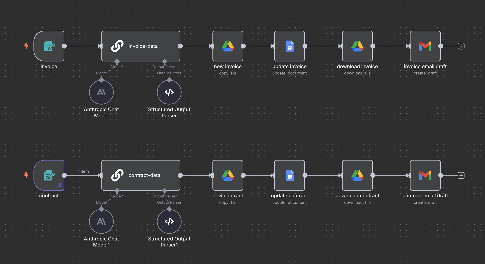

# n8n 견적서/계약서 자동화 워크플로우 설정 가이드

n8n을 활용하여 견적서와 계약서를 자동으로 생성하고, 이메일 드래프트까지 작성해주는 자동화 시스템 구축 가이드입니다.

## 📋 개요

이 워크플로우는 다음과 같은 기능을 제공합니다:
- 간단한 폼 입력만으로 견적서/계약서 자동 생성
- AI를 활용한 데이터 포맷팅 및 계산
- Google Drive를 통한 문서 생성 및 관리
- Gmail 드래프트 자동 작성 및 파일 첨부

## 📚 목차

1. [워크플로우 구조](#워크플로우-구조)
2. [사전 준비사항](#사전-준비사항)
3. [견적서 워크플로우 설정](#견적서-워크플로우-설정)
4. [계약서 워크플로우 설정](#계약서-워크플로우-설정)
5. [배포 및 사용](#배포-및-사용)
6. [시스템 설계 철학](#시스템-설계-철학)
7. [문제 해결](#문제-해결)
8. [추가 설정 및 팁](#추가-설정-및-팁)
9. [마무리](#마무리)
10. [참고 자료](#참고-자료)

---
## 워크플로우 구조



1. **Form 입력** → 2. **AI 데이터 처리** → 3. **템플릿 복사** → 4. **문서 업데이트** → 5. **파일 다운로드** → 6. **이메일 드래프트 생성**

## 사전 준비사항

### 1. API 키 설정
- **Claude API**: [Anthropic Console](https://console.anthropic.com/dashboard)에서 API 키 발급
- **Google Drive API**: Google Cloud Console에서 Drive API 활성화
- **Gmail API**: Google Cloud Console에서 Gmail API 활성화

### 2. 템플릿 파일 준비
Google Drive에 견적서 및 계약서 템플릿 파일을 미리 생성해두세요. 템플릿에는 `<<placeholder>>` 형식의 자리표시자를 사용합니다. 템플릿 예시는 문서 마지막 참고자료를 참고해주세요.

#### 견적서 템플릿 자리표시자 예시
```
<<client_name>>, <<client_company>>, <<estimate_date>>, <<document_date>>, 
<<expiration_date>>, <<item_1>>, <<unit_price_1>>, <<count_1>>, <<amount_1>>, 
<<total_amount>>, <<project_start_date>>, <<project_end_date>>, <<service_scope>>
```

#### 계약서 템플릿 자리표시자 예시
```
<<contract_date>>, <<client_company_name>>, <<client_ceo>>, <<service_name>>, 
<<work_content>>, <<contract_start_date>>, <<contract_end_date>>, 
<<total_amount>>, <<down_payment>>, <<final_payment>>
```

## 견적서 워크플로우 설정

### 1. Form 트리거 설정

**Form 트리거 노드 추가**
- Authentication: Basic Auth (보안을 위해 ID/Password 설정)
- Form Title: "견적서 정보"
- Form Description: "견적서 작성에 필요한 정보 수집"

**Form Elements 설정**
```
Name (텍스트): 담당자 이름 [Required]
Company (텍스트): 회사명 [Required]
Task (드롭다운): 
  - n8n 자동화 시스템 구축
  - make 자동화 시스템 구축
  - AI 툴 활용 시스템 구축
  - 노코드 활용 시스템 구축
Task Count (텍스트): 과업 횟수 기입
Service Detail (텍스트): 구체적인 과업 내용 기입
Project Start Date (날짜)
Project End Date (날짜)
```

### 2. AI 데이터 처리 노드 설정

**Basic LLM Chain 노드 추가**
- Model: Claude 3.7 Sonnet (Or Sonnet 4)
- Require Specific Output Format: 활성화
- Output Parser: JSON

**시스템 프롬프트 (견적서용)**
```
너는 컨설팅 회사의 견적서 생성 담당자야.

너의 역할은, 견적서 템플릿에서 사용되는 자리표시자(<< >>)에 들어갈 값을 생성하여  
key-value 형태의 JSON 객체로 정리하는 것이야.  
너는 전체 문서를 작성하지 않고, 오직 자리표시자에 들어갈 값만 정확하게 출력해야 해.

출력 형식은 아래 예시처럼, 템플릿의 자리표시자 이름을 그대로 key로 사용해서 구성해야 해:

예시:
{
  "client_name": "홍길동",
  "client_company": "길동컨설팅",
  "item_1": "n8n 자동화 시스템 구축",
  ...
}

다음 조건을 반드시 지켜야 해:

1. 금액(amount)은 unit_price × count로 계산하고, 반드시 3자리 콤마(,)와 "원" 단위를 붙여 표기해. 예: "1,000,000원"
2. 항목(item)/단가(unit_price)/횟수(count)/금액(amount)이 4개 이하일 경우, 부족한 항목은 빈 문자열("")로 채워.
3. 총금액(total_amount)은 개별 항목들의 금액(amount) 합계로 계산해.
4. 발신일자(estimate_date)와 견적서 작성일(document_date)은 오늘 날짜 {{ $today.format('yyyy-MM-dd') }}로 동일하게 입력해.
5. 유효기간(expiration_date)은 오늘 날짜 기준 14일 뒤 날짜로 계산해.
6. 단가(unit_price)는 항목명(item)에 따라 아래 규칙을 자동 적용해:
   - n8n 자동화 시스템 = 500,000원
   - make 자동화 시스템 = 500,000원
   - AI 자동화 시스템 = 1,000,000원
   - 노코드 자동화 시스템 = 300,000원

7. 서비스 범위(service_scope)는 사용자가 주관식으로 입력한 텍스트 데이터를 기반으로,
   - 견적서에 적합한 명확하고 간결한 작업 항목 목록으로 정리해.
   - 각 항목은 `- 항목명` 형식의 불릿포인트로 작성하고, 줄바꿈(\n)으로 구분된 하나의 문자열로 구성해.
   - 최대 4개까지 포함 가능하며, 부족하면 생략해도 됨.

8. 모든 값은 한국어로 작성하고, 숫자는 반드시 3자리 콤마와 "원" 단위를 포함해서 표기해.

출력은 반드시 JSON 형식으로만 하며, 설명 문장이나 기타 텍스트는 포함하지 마.
```

**유저 프롬프트 (견적서용)**
```
아래는 견적서 생성을 위한 입력 정보야.  
이 정보를 바탕으로, 견적서 템플릿에서 사용될 자리표시자(<< >>)에 들어갈 값을  
key-value 형식의 JSON 객체로 생성해줘.

출력은 반드시 JSON 형식으로만 하고, 설명 문장이나 기타 텍스트는 포함하지 마.

입력 정보:
- client_name: {{ $json.Name }}
- client_company: {{ $json.Company }}

- Task list:
- Task 1: {{ $json.Task[0] }}
{{ $json.Task[1] ? '- Task 2: ' + $json.Task[1] : '' }}
{{ $json.Task[2] ? '- Task 3: ' + $json.Task[2] : '' }}
{{ $json.Task[3] ? '- Task 4: ' + $json.Task[3] : '' }}

- Task Count: {{ $json["Task Count"] }}
- Service Scope: {{ $json["Service Detail"] }}
- Project Start Date: {{ $json["Project Start Date"] }}
- Project End Date: {{ $json["Project End Date"] }}

주의:
- 과업 항목 수, 횟수, 서비스 범위는 최대 4개까지 있을 수 있어. 같은 순서대로 아래와 같이 JSON 필드에 매핑해줘:
  - item_1, unit_price_1, count_1, amount_1  
  - service_scope …

- 항목이 부족하면 "item_2": "" 처럼 빈 문자열로 채워줘.

- 금액(amount)은 단가(unit_price) × 횟수(count)로 계산해. 단가(unit_price)는 아래 규칙을 따르도록 해:
  - "n8n 자동화 시스템" = 500,000원  
  - "make 자동화 시스템" = 500,000원  
  - "AI 자동화 시스템" = 1,000,000원  
  - "노코드 자동화 시스템" = 300,000원

- 견적일자(estimate_date)와 견적서 작성일(document_date)은 오늘 날짜 ({{ $today.format('yyyy-MM-dd') }})를 사용해.
- 유효기간(expiration_date)은 오늘 날짜 기준 14일 뒤 날짜로 계산해줘.
- 총합(total_amount)은 모든 amount의 합으로 계산해줘.
- 숫자는 3자리 콤마를 포함하고, 반드시 "원" 단위를 붙여서 표기해.

JSON 키는 아래와 같은 템플릿 키와 정확히 일치해야 해:
- client_name, client_company, estimate_date, document_date, expiration_date
- item_1~4, unit_price_1~4, count_1~4, amount_1~4
- total_amount
- project_start_date, project_end_date
- service_scope

반드시 JSON만 반환해.
```

**JSON Output Parser 예시 (견적서용)**
```json
{
  "client_name": "회사원A",
  "client_company": "회사A",
  "estimate_date": "2025-05-21",
  "document_date": "2025-05-21",
  "expiration_date": "2025-06-04",
  "item_1": "n8n 자동화 시스템 구축",
  "unit_price_1": "500,000원",
  "count_1": "1",
  "amount_1": "500,000원",
  "item_2": "",
  "unit_price_2": "",
  "count_2": "",
  "amount_2": "",
  "item_3": "",
  "unit_price_3": "",
  "count_3": "",
  "amount_3": "",
  "item_4": "",
  "unit_price_4": "",
  "count_4": "",
  "amount_4": "",
  "total_amount": "500,000원",
  "project_start_date": "2025-05-27",
  "project_end_date": "2025-06-03",
  "service_scope": "n8n을 활용한 견적서 제작 시스템 구축"
}
```

### 3. Google Drive 파일 복사 노드

**Copy File 노드 설정**
- Credential: Google Drive 계정 연결
- File to Copy: 견적서 템플릿 파일 선택
- Name: `[{{ $json.output.client_company }}]{{ $('invoice').item.json.Task[0] }}_견적서_{{ $json.output.document_date }}`
- Parent Folder: 원하는 폴더 지정

### 4. Google Docs 업데이트 노드

**Update Document 노드 설정**
- Document ID: 이전 단계에서 생성된 파일 ID 매핑
- Actions > Text > Find and Replace Text 추가

각 자리표시자별로 Find and Replace 설정:
```
Find: <<client_name>>
Replace: {{ $('invoice-data').item.json.output.client_name }}

Find: <<client_company>>
Replace: {{ $('invoice-data').item.json.output.client_company }}

Find: <<estimate_date>>
Replace: {{ $('invoice-data').item.json.output.estimate_date }}

Find: <<document_date>>
Replace: {{ $('invoice-data').item.json.output.document_date }}

Find: <<expiration_date>>
Replace: {{ $('invoice-data').item.json.output.expiration_date }}

Find: <<item_1>>
Replace: {{ $('invoice-data').item.json.output.item_1 }}

Find: <<unit_price_1>>
Replace: {{ $('invoice-data').item.json.output.unit_price_1 }}

Find: <<count_1>>
Replace: {{ $('invoice-data').item.json.output.count_1 }}

Find: <<amount_1>>
Replace: {{ $('invoice-data').item.json.output.amount_1 }}

Find: <<item_2>>
Replace: {{ $('invoice-data').item.json.output.item_2 }}

Find: <<unit_price_2>>
Replace: {{ $('invoice-data').item.json.output.unit_price_2 }}

Find: <<count_2>>
Replace: {{ $('invoice-data').item.json.output.count_2 }}

Find: <<amount_2>>
Replace: {{ $('invoice-data').item.json.output.amount_2 }}

Find: <<item_3>>
Replace: {{ $('invoice-data').item.json.output.item_3 }}

Find: <<unit_price_3>>
Replace: {{ $('invoice-data').item.json.output.unit_price_3 }}

Find: <<count_3>>
Replace: {{ $('invoice-data').item.json.output.count_3 }}

Find: <<amount_3>>
Replace: {{ $('invoice-data').item.json.output.amount_3 }}

Find: <<item_4>>
Replace: {{ $('invoice-data').item.json.output.item_4 }}

Find: <<unit_price_4>>
Replace: {{ $('invoice-data').item.json.output.unit_price_4 }}

Find: <<count_4>>
Replace: {{ $('invoice-data').item.json.output.count_4 }}

Find: <<amount_4>>
Replace: {{ $('invoice-data').item.json.output.amount_4 }}

Find: <<total_amount>>
Replace: {{ $('invoice-data').item.json.output.total_amount }}

Find: <<project_start_date>>
Replace: {{ $('invoice-data').item.json.output.project_start_date }}

Find: <<project_end_date>>
Replace: {{ $('invoice-data').item.json.output.project_end_date }}

Find: <<service_scope>>
Replace: {{ $('invoice-data').item.json.output.service_scope }}
```

### 5. 파일 다운로드 노드

**Download File 노드 설정**
- File ID: 업데이트된 문서 ID 매핑

### 6. Gmail 드래프트 생성 노드

**Create Draft 노드 설정**
- Subject: `[구씨]{{ $('invoice-data').item.json.output.client_company }}-{{ $('invoice-data').item.json.output.item_1 }}-견적서 전달건`
- Message Body:
```
안녕하세요, 구씨입니다.

회사명: {{ $('invoice-data').item.json.output.client_company }}
서비스 내용: 
{{ $('invoice-data').item.json.output.service_scope }}
총 견적금액: {{ $('invoice-data').item.json.output.total_amount }}
프로젝트 기간: {{ $('invoice-data').item.json.output.project_start_date }} ~ {{ $('invoice-data').item.json.output.project_end_date }}

첨부된 견적서를 검토해주시고, 이상 없으시면 회신 부탁드립니다.
추가 요청 사항이나 수정이 필요한 부분이 있으시면 편하게 말씀 주세요.

감사합니다.
구씨 드림
citizendev9c@gmail.com / 010-1111-1111
```
- Attachments: data (다운로드된 파일)

## 계약서 워크플로우 설정

### 1. Form Elements 설정 (계약서용)
```
Company Name (텍스트): 클라이언트 회사 이름 [Required]
Service (드롭다운): 
  - n8n 자동화 시스템 구축
  - make 자동화 시스템 구축
  - AI툴 활용 시스템 구축
  - 노코드 활용 시스템 구축
Work Content (텍스트): 서비스 제공 세부 사항
Contract Start Date (날짜)
Contract End Date (날짜)
Total Amount (텍스트): (원) 부가세 별도 기준 금액
Company CEO (텍스트): 클라이언트 대표자 성명 (서명용)
```

### 2. AI 시스템 프롬프트 (계약서용)
```
너는 컨설팅 회사의 계약서 생성 담당자야.

너의 역할은, 계약서 템플릿에서 사용되는 자리표시자(<< >>)에 들어갈 값을 생성하여  
key-value 형태의 JSON 객체로 정리하는 것이야.  
너는 전체 계약서 문서를 작성하지 않고, 오직 자리표시자에 들어갈 값만 정확하게 출력해야 해.

출력 형식은 아래 예시처럼, 템플릿의 자리표시자 이름을 그대로 key로 사용해서 구성해야 해:

예시:
{
  "contract_date": "2025-05-20",
  "client_company_name": "길동컨설팅",
  "service_name": "n8n 자동화 시스템 구축",
  ...
}

다음 조건을 반드시 지켜야 해:

1. 날짜 관련 규칙:
- contract_date는 오늘 날짜 {{ $today.format('yyyy-MM-dd') }}로 입력해.
- contract_start_date와 contract_end_date는 사용자로부터 입력된 값을 그대로 넣어.

2. 금액 관련 규칙:
- total_amount, down_payment, final_payment 항목은 반드시 3자리 콤마(,)를 포함하고 "원" 단위를 붙여. 예: "1,500,000원"
- 값이 없더라도 빈 문자열("")로 넣지 말고 "0원"이라고 표기해.
- down_payment와 final_payment는 total_amount를 기준으로 각각 50%씩 자동 계산해.
- total_amount가 3,000,000원이면 down_payment는 1,500,000원, final_payment도 1,500,000원

3. 서비스 정보:
- service_name은 사용자가 선택하거나 입력한 여러 서비스명을 기반으로,  
  계약서에 적합한 간결하고 전문적인 통합 서비스 이름을 자동 생성해.  
  예: ["n8n 자동화 시스템 구축", "make 자동화 시스템 구축"] → "n8n 및 make 자동화 시스템 컨설팅"
- work_content은 사용자가 자유롭게 입력한 주관식 텍스트를 기반으로,  
  계약서에 적합한 작업 범위 항목으로 재구성해.  
  각 항목은 `- 항목내용` 형식의 불릿포인트로 작성하고, 줄바꿈(`\n`)으로 구분된 하나의 문자열로 반환해.  
  최대 5개까지 포함 가능하며, 항목이 부족하면 생략해도 됨.

4. 클라이언트 정보:
- client_company_name에는 클라이언트 회사명을, client_ceo에는 대표자 이름을 입력해.

5. 출력 포맷:
- 모든 값은 한국어로 작성해야 해.
- 금액은 반드시 3자리 콤마와 "원" 단위를 포함해서 표기하고, 단위를 절대 생략하지 마.
- 모든 값은 key-value 쌍으로 구성된 JSON 객체로 출력하고,
  설명 문장이나 계약서 본문 전체를 작성하지 말 것.

출력은 반드시 JSON 형식으로만 하며, 설명 문장이나 기타 텍스트는 포함하지 마.
```

### 3. AI 유저 프롬프트 (계약서용)
```
아래는 계약서 작성을 위한 입력 정보야.  
이 정보를 바탕으로 시스템 프롬프트에서 요구한 포맷에 맞춰  
자리표시자(<< >>)에 들어갈 값을 JSON 형식으로 작성해줘.  
절대로 설명이나 문장은 포함하지 마. 오직 JSON만 출력해.

입력 정보:
- contract_date: {{ $today.format('yyyy-MM-dd') }}
- client_company_name: {{ $json['Company Name'] }}
- client_ceo: {{ $json['Company CEO'] }}
- service_name: {{ 
  [
    $json.Service[0],
    $json.Service[1],
    $json.Service[2],
    $json.Service[3]
  ]
  .filter(e => !!e)
  .join(', ')
}}

- work_content: {{ $json['Work Content'] }}
- contract_start_date: {{ $json['Contract Start Date'] }}
- contract_end_date: {{ $json['Contract End Date'] }}
- total_amount: {{ $json['Total Amount'] }}

주의사항:
- 총 계약금액(total_amount)의 50%는 계약 체결 시(down_payment), 나머지 50%는 최종 결과물 제출 시(final_payment)로 자동 계산해.
- 금액은 모두 3자리 콤마(,) + "원" 단위로 표기하고, 누락 시 "0원"으로 입력해.
- 업무 범위는 work_content_1 ~ 3 중 존재하는 항목만 요약 정리해서 **하나의 문자열**로 `work_content` 필드에 입력해.
- 출력 JSON의 키는 아래와 같아야 해:
  - contract_date, client_company_name, client_ceo, service_name, work_content
  - contract_start_date, contract_end_date
  - total_amount, down_payment, final_payment

반드시 JSON만 반환해.
```

### 4. JSON Output Parser 예시 (계약서용)
```json
{
  "contract_date": "2025-05-21",
  "client_company_name": "알파컨설팅",
  "client_ceo": "홍길동",
  "service_name": "n8n 및 AI 자동화 컨설팅",
  "work_content": "- 기존 업무 프로세스 분석\n- n8n을 활용한 자동화 시나리오 설계\n- AI 기능 연동 및 테스트\n- 최종 결과물 문서화 및 인수인계",
  "contract_start_date": "2025-05-27",
  "contract_end_date": "2025-06-07",
  "total_amount": "3,000,000원",
  "down_payment": "1,500,000원",
  "final_payment": "1,500,000원"
}
```

### 5. Google Drive 파일 복사 노드 (계약서용)

**Copy File 노드 설정**
- File to Copy: 계약서 템플릿 파일 선택
- Name: `[{{ $json.output.client_company_name }}]{{ $json.output.service_name }}_계약서_{{ $json.output.contract_date }}`

### 6. Google Docs 업데이트 노드 (계약서용)

각 자리표시자별로 Find and Replace 설정:
```
Find: <<contract_date>>
Replace: {{ $('contract-data').item.json.output.contract_date }}

Find: <<client_company_name>>
Replace: {{ $('contract-data').item.json.output.client_company_name }}

Find: <<client_ceo>>
Replace: {{ $('contract-data').item.json.output.client_ceo }}

Find: <<service_name>>
Replace: {{ $('contract-data').item.json.output.service_name }}

Find: <<work_content>>
Replace: {{ $('contract-data').item.json.output.work_content }}

Find: <<contract_start_date>>
Replace: {{ $('contract-data').item.json.output.contract_start_date }}

Find: <<contract_end_date>>
Replace: {{ $('contract-data').item.json.output.contract_end_date }}

Find: <<total_amount>>
Replace: {{ $('contract-data').item.json.output.total_amount }}

Find: <<down_payment>>
Replace: {{ $('contract-data').item.json.output.down_payment }}

Find: <<final_payment>>
Replace: {{ $('contract-data').item.json.output.final_payment }}
```

### 7. Gmail 드래프트 생성 노드 (계약서용)

**Create Draft 노드 설정**
- Subject: `[구씨]{{ $('contract-data').item.json.output.client_company_name }}-{{ $('contract-data').item.json.output.service_name }}-계약서 초안 전달건`
- Message Body:
```
안녕하세요, 구씨입니다.

회사명: {{ $('contract-data').item.json.output.client_company_name }}
서비스명: {{ $('contract-data').item.json.output.service_name }}
총 계약금액: {{ $('contract-data').item.json.output.total_amount }}
계약 기간: {{ $('contract-data').item.json.output.contract_start_date }} ~ {{ $('contract-data').item.json.output.contract_end_date }}

첨부드린 계약서를 검토해주시고, 이상 없으시면 서명 후 회신 부탁드립니다.
추가로 협의가 필요하거나 수정이 필요한 부분 있으시면 언제든지 말씀 주세요.

감사합니다.
구씨 드림
citizendev9c@gmail.com / 010-1111-1111
```
- Attachments: data (다운로드된 파일)

## 배포 및 사용

### 1. 워크플로우 활성화
- Test URL을 Production URL로 변경
- 워크플로우를 Active 상태로 설정

### 2. 사용 방법
1. 생성된 Form URL에 접속
2. 필요한 정보 입력 후 제출
3. Google Drive에서 생성된 문서 확인
4. Gmail 임시보관함에서 드래프트 확인 후 발송

## 시스템 설계 철학

이 자동화 시스템은 다음 원칙을 바탕으로 설계되었습니다:

### 안정성과 유연성의 균형
- **고정 워크플로우**: 명확한 순서가 있는 작업에 적합
- **AI 활용**: 복잡한 포맷팅 작업을 유연하게 처리
- **자리표시자 방식**: 전체 문서 생성 대비 안정적이고 비용 효율적

### 사용자 경험 최적화
- **최소 입력**: Form에는 꼭 필요한 정보만 수집
- **AI 자동화**: 복잡한 계산과 포맷팅은 AI가 처리
- **드래프트 생성**: 최종 검토 후 발송 가능

## 문제 해결

### 자주 발생하는 문제들

1. **API 연결 실패**: 각 서비스의 API 키가 올바르게 설정되었는지 확인
2. **템플릿 오류**: 자리표시자 형식이 `<<placeholder>>` 형태로 정확히 작성되었는지 확인
3. **JSON 파싱 오류**: AI 출력 파서의 예시 JSON 형식이 올바른지 확인
4. **권한 오류**: Google Drive/Gmail 권한이 올바르게 설정되었는지 확인

### 디버깅 팁
- 각 노드별로 Test Step을 실행하여 단계별 확인
- AI 노드의 출력 결과를 먼저 확인
- 템플릿 파일의 자리표시자와 AI 출력 키가 일치하는지 확인

## 추가 설정 및 팁

### 노드 이름 설정 권장사항
워크플로우 관리를 위해 다음과 같이 노드 이름을 설정하는 것을 권장합니다:

**견적서 워크플로우:**
- Form 트리거: `invoice` 
- AI 노드: `invoice-data`
- Google Drive Copy: `copy-invoice-template`
- Google Docs Update: `update-invoice-doc`
- Download File: `download-invoice`
- Gmail Draft: `invoice-email-draft`

**계약서 워크플로우:**
- Form 트리거: `contract`
- AI 노드: `contract-data` 
- Google Drive Copy: `copy-contract-template`
- Google Docs Update: `update-contract-doc`
- Download File: `download-contract`
- Gmail Draft: `contract-email-draft`


## 마무리

이 가이드를 통해 n8n을 활용한 견적서/계약서 자동화 시스템을 구축할 수 있습니다. 핵심은 다음과 같습니다:

1. **최소한의 입력으로 최대한의 자동화** - Form에는 꼭 필요한 정보만 수집
2. **AI를 통한 유연한 데이터 처리** - 복잡한 포맷팅과 계산을 AI가 담당
3. **안정적인 워크플로우 설계** - 고정된 순서로 예측 가능한 결과 보장
4. **사용자 검토 단계 포함** - 드래프트 생성으로 최종 확인 후 발송

이 시스템을 통해 반복적인 문서 작업에서 해방되어 더 중요한 업무에 집중할 수 있게 될 것입니다.

## 참고 자료

- [견적서 템플릿 참고](https://docs.google.com/document/d/1eMYVxwaAsXZ1aSXclIHPN1GcLWNFyeOLS6QPPkj0dzE/edit?usp=sharing)
- [계약서 템플릿 참고](https://docs.google.com/document/d/1hftaaaVca9JSvAEmHfAo2k3tNh0F9OlsmNhL9r-u3j8/edit?usp=sharing)
- [n8n 공식 문서](https://docs.n8n.io/)
- [Claude API 연결](https://console.anthropic.com/)
- [Google API 연결](https://console.cloud.google.com/)