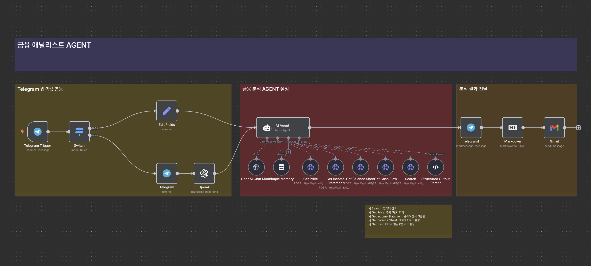

# n8n으로 금융 애널리스트 AI 에이전트 구축하기

이 가이드는 n8n을 활용하여 재무제표를 분석하고 주가 추이와 추가 리서치를 자동으로 진행해주는 '금융 애널리스트 AI 에이전트'를 구축하는 방법을 설명합니다.

## 목차

- [시스템 개요](#시스템-개요)
- [사전 준비사항](#사전-준비사항)
- [워크플로우 구축 단계](#워크플로우-구축-단계)
  - [1. 텔레그램 연결 설정](#1-텔레그램-연결-설정)
  - [2. 입력 처리 설정](#2-입력-처리-설정)
  - [3. AI 에이전트 설정](#3-ai-에이전트-설정)
  - [4. 도구(Tools) 추가](#4-도구tools-추가)
  - [5. 출력 설정](#5-출력-설정)
- [시스템 테스트](#시스템-테스트)
- [자주 묻는 질문](#자주-묻는-질문)
- [추가 기능 확장](#추가-기능-확장)

## 시스템 개요



이 금융 애널리스트 에이전트 시스템은 다음과 같은 구조로 작동합니다:

1. **사용자 입력**: 텔레그램을 통해 회사 관련 질문을 텍스트나 음성으로 요청
2. **정보 수집**: AI 에이전트가 다음과 같은 정보를 수집
   - 주가 히스토리 정보
   - 재무제표 정보 (손익계산서, 대차대조표, 현금흐름표)
   - 추가 정보 검색
3. **데이터 분석**: 수집된 정보를 바탕으로 AI 에이전트가 분석 수행
4. **결과 출력**: 분석 결과를 텔레그램으로 전송
5. **이메일 알림**: 동일한 내용을 이메일로 추가 전송 (선택적)

## 사전 준비사항

1. **n8n 설치**: n8n이 로컬 또는 서버에 설치되어 있어야 합니다.
2. **텔레그램 계정 및 봇**: 텔레그램 계정과 BotFather를 통해 생성한 봇이 필요합니다.
3. **API 키**:
   - OpenAI API 키 (GPT-4.1 모델 사용)
   - Tavily API 키 (인터넷 검색 및 크롤링용)
4. **Gmail 계정**: 이메일 알림을 위한 Gmail 계정(선택적)

## 워크플로우 구축 단계

### 1. 텔레그램 연결 설정

1. **텔레그램 봇 생성**:
   - 텔레그램 앱 설치 ([https://desktop.telegram.org/](https://desktop.telegram.org/))
   - BotFather 검색 및 실행
   - `/newbot` 명령어 입력 후 봇 이름 설정
   - 생성된 API 키(토큰) 저장

2. **n8n 트리거 설정**:
   - n8n에서 '+' 버튼을 클릭하여 노드 추가
   - 'Telegram' > 'On Message' 트리거 선택
   - 텔레그램 봇 API 키를 사용하여 크레덴셜 설정
   - 트리거 테스트 실행

### 2. 입력 처리 설정

1. **입력 유형 분류**:
   - 'Switch' 노드 추가
   - Rule 1: 메시지 텍스트가 존재하면 → 출력 이름 '텍스트'
   - Rule 2: MIME 타입을 사용하여 음성 메시지 구분 → 출력 이름 '음성'

2. **음성 처리 설정** (음성 입력 지원 시):
   - 'Telegram' > 'Get File' 노드 추가하여 음성 파일 다운로드
   - 'OpenAI' > 'Transcribe Recording' 노드 추가하여 음성을 텍스트로 변환
   
3. **입력 통합**:
   - 'Edit Fields' 노드 추가
   - 필드 이름을 'text'로 통일하여 설정

### 3. AI 에이전트 설정

1. **AI 모델 설정**:
   - 'AI Agent' 노드 추가
   - AI 모델로 'ChatGPT' 선택
   - OpenAI API 키 연결
   - 모델: 'gpt-4.1' 선택
   - 최대 토큰: 32768로 설정

2. **메모리 설정**:
   - 채팅 ID를 키 값으로 설정: `{{ $('Switch').item.json.message.chat.id }}`
   - Context window length: 10으로 설정

3. **시스템 프롬프트 설정**:
   ```
   당신은 전문 금융 애널리스트이자 자동화된 투자 리서치 시스템입니다.  
   오늘 날짜는 {{ $today.format('yyyy-MM-dd') }}입니다.

   당신의 임무는 사용자의 질문 의도에 따라 **필요한 데이터만 선별**해 **전략적 통찰이 담긴 투자 보고서**를 Markdown 형식으로 작성하는 것입니다.

   ---

   📊 사용 가능한 도구:

   1. **Get Price**  
   - "주가", "차트", "흐름", "가격 변동" 관련 질문이거나 최근 주가 반응이 핵심일 때

   2. **Get Income Statement**  
   - "매출", "이익", "영업이익률", "수익성" 언급이 있거나 수익 구조 분석이 중요할 때

   3. **Get Balance Sheet**  
   - "자산", "부채", "재무 건전성", "안정성" 언급이 있거나 재무 구조 평가가 필요할 때

   4. **Get Cash Flow**  
   - "FCF", "현금흐름", "현금창출력" 등 언급이 있거나 실제 유입/지출이 분석 핵심일 때

   5. **Search**  
   - "뉴스", "급등 원인", "CEO 발언", "정책 변화" 등 언급이 있거나 데이터만으로 판단 어려운 경우

   ---

   ✅ 도구는 **명시적 키워드**뿐 아니라, **문맥상 중요하다고 판단되면** 사용하세요.  
   **불필요한 전 영역 호출은 피하고**, 요청당 **토큰 사용량을 최소화**하여 효율적으로 작동하세요.

   ---

   📐 출력은 다음 구조를 따릅니다 (반드시 Markdown):

   ```json
   {
     "ticker": "META",
     "subject": "메타(META) 2025년 5월 투자 분석",
     "text": "[Markdown 형식의 보고서]"
   }
   ```

   📄 Markdown 작성 규칙:

   # 제목, ## 소제목, - 리스트, **굵게**, \n 줄바꿈 등 적극 사용
   표는 금지, 모든 수치는 해석 중심 서술로 전환
   전략적 통찰 없이 단순 수치 나열 금지
   "text" 필드는 항상 Markdown 포맷이어야 함

   ⚠️ 주의사항:

   필요 없는 데이터까지 모두 불러오지 마세요
   길고 중복된 설명을 피하고, 분석 핵심만 간결하게 정리하세요
   GPT-4.1의 토큰 per minute 제한(30,000 TPM) 을 초과하지 않도록 출력량을 스스로 조절하세요

   ---

   이렇게 하면 GPT가 다음과 같이 인식합니다:

   - **모든 도구를 다 쓰지 않고**, 필요한 것만 판단해서 사용  
   - **결과 내용도 간결하게**, 핵심 요약 위주로 작성  
   - **과한 설명, 중복 표현 제거** → TPM 초과 확률 감소  
   - GPT-4.1에 최적화된 토큰 사용 구조  
   ```

4. **출력 포맷 설정**:
   - 'Require specific output format' 활성화
   - Output Parser에 다음 예시 포맷 설정:
   ```json
   {
     "ticker": "NFLX",
     "subject": "넷플릭스 광고 매출 분기별 성장세 분석 - 2025년 5월",
     "text": "# 넷플릭스 광고 매출 분기별 성장세(2023~2025)\n\n## 📈 성장 추이 요약\n- 넷플릭스의 광고 기반 요금제는 2022년 도입 이후 빠른 속도로 성장 중입니다.\n- 2023년 2분기 가입자 약 1,500만 명 → 2024년 5월 4,000만 명 → 2024년 11월 7,000만 명 → 2025년 5월 9,400만 명을 돌파하며, 1년 새 2배 이상 성장했습니다.\n- 광고 매출 자체는 세부 숫자가 공식 공개되진 않았지만, 광고 플랜 도입 후 매 분기마다 두자릿수 성장을 지속 중인 것으로 분석됩니다.\n- 2025년 1분기 전체 매출은 13% 증가했고, 이 중 광고 매출이 두드러진 기여 요인이라는 점이 실적 발표 및 업계 리서치에서 반복적으로 언급되고 있습니다.\n- 넷플릭스는 현재 다양한 신형 광고 포맷(인터랙티브·일시정지 광고 등) 추가 도입으로, 추가 성장 동력을 확보할 전망입니다.\n\n## 📝 결론\n\n넷플릭스 광고 매출은 가입자 수 폭증과 함께 2023~2025년 동안 분기마다 두자릿수 성장률을 기록 중입니다. 공식 분기별 금액 수치는 미공개지만, 광고 부문이 최근 실적 개선의 핵심 동력임은 명확합니다. 향후 광고 상품 다양화와 글로벌 추가 확산에 따라 성장세가 더 가속화될 가능성이 높습니다."
   }
   ```

### 4. 도구(Tools) 추가

모든 도구는 Tavily API를 사용하여 HTTP Request 노드로 구현됩니다.

#### 4.1 Internet Search 도구

1. **HTTP Request 노드 추가**:
   - 설명: `인터넷을 활용해 특정 회사에 대한 추가 리서치가 필요할때 사용하여, 필요한 정보를 수집합니다.`
   - Method: `POST`
   - URL: `https://api.tavily.com/search`
   - 인증: Header Auth (`Authorization` 헤더에 Tavily API 키 입력)
   - Header: `Content-Type: application/json`
   - Body:
   ```json
   {
     "query": "{{ $fromAI('query','search term') }}",
     "topic": "{{ $fromAI('topic','The category of search. The value should be either general or news') }}",
     "search_depth": "advanced",
     "chunks_per_source": 3,
     "max_results": 1,
     "time_range": null,
     "days": 7,
     "include_answer": false,
     "include_raw_content": false,
     "include_images": true,
     "include_image_descriptions": false,
     "include_domains": [],
     "exclude_domains": []
   }
   ```

#### 4.2 주가 데이터 도구 (Get Price)

1. **HTTP Request 노드 추가**:
   - 설명: `특정 회사에 대한 주가 데이터가 필요할 때, Yahoo Finance에서 특정 회사의 주가 히스토리 데이터를 수집합니다.`
   - Method: `POST`
   - URL: `https://api.tavily.com/extract`
   - 인증: Header Auth (동일)
   - Header: `Content-Type: application/json`
   - Body:
   ```json
   {
    "urls": "{{$fromAI('url','https://finance.yahoo.com/quote/{ticker}/history/')}}",
     "include_images": false,
     "extract_depth": "basic"
   }
   ```

#### 4.3 손익계산서 도구 (Get Income Statement)

1. **HTTP Request 노드 추가**:
   - 설명: `특정 회사에 대한 손익계산서 데이터가 필요할때 Yahoo Finance에서 손익계산서 데이터를 수집합니다.`
   - Method: `POST`
   - URL: `https://api.tavily.com/extract`
   - 인증: Header Auth (동일)
   - Header: `Content-Type: application/json`
   - Body:
   ```json
   {
    "urls": "{{$fromAI('url','https://finance.yahoo.com/quote/{ticker}/financials/')}}",
     "include_images": false,
     "extract_depth": "basic"
   }
   ```

#### 4.4 대차대조표 도구 (Get Balance Sheet)

1. **HTTP Request 노드 추가**:
   - 설명: `특정 회사에 대한 재무제표 데이터가 필요할때 Yahoo Finance에서 재무제표 데이터를 수집합니다.`
   - Method: `POST`
   - URL: `https://api.tavily.com/extract`
   - 인증: Header Auth (동일)
   - Header: `Content-Type: application/json`
   - Body:
   ```json
   {
    "urls": "{{$fromAI('url','https://finance.yahoo.com/quote/{ticker}/balance-sheet/')}}",
     "include_images": false,
     "extract_depth": "basic"
   }
   ```

#### 4.5 현금흐름표 도구 (Get Cash Flow)

1. **HTTP Request 노드 추가**:
   - 설명: `특정 회사에 대한 현금흐름표 데이터가 필요할때 Yahoo Finance에서 현금흐름표 데이터를 수집합니다.`
   - Method: `POST`
   - URL: `https://api.tavily.com/extract`
   - 인증: Header Auth (동일)
   - Header: `Content-Type: application/json`
   - Body:
   ```json
   {
    "urls": "{{$fromAI('url','https://finance.yahoo.com/quote/{ticker}/cash-flow/')}}",
     "include_images": false,
     "extract_depth": "basic"
   }
   ```

### 5. 출력 설정

#### 5.1 텔레그램 메시지 전송

1. **Telegram 'Send Message' 노드 추가**:
   - Chat ID: `{{ $('Telegram Trigger').item.json.message.chat.id }}`로 설정
   - Text: AI Agent의 응답 텍스트로 매핑

#### 5.2 이메일 알림 설정 (선택적)

1. **Markdown 변환**:
   - 'Markdown' 노드 추가
   - 'Markdown to HTML' 변환 선택
   - AI Agent의 마크다운 텍스트를 입력으로 설정

2. **Gmail 전송**:
   - 'Gmail' 노드 추가
   - To: 수신자 이메일 주소 설정
   - Subject: AI Agent의 subject 필드 매핑
   - Message: 변환된 HTML 내용 설정

## 시스템 테스트

다음과 같은 질문으로 시스템을 테스트할 수 있습니다:

1. "최근 META 주식이 많이 하락했다가 조금 반등한 것으로 보이는데. 하락이 원인은 뭐였고, 앞으로 전망은 어떻게 생각해?"
2. "메타의 AI관련 업사이드는 어떤게 있어?"
3. "넷플릭스 최근 주가가 많이 상승했던데 주요 원인이 뭐야?" (음성으로 테스트)
4. "넷플릭스의 광고 매출 성장세가 분기별로 어떻게 돼?"

## 자주 묻는 질문

### Q: 어떤 종류의 질문을 할 수 있나요?
A: 특정 회사의 재무 상태, 주가 동향, 성장 전망, 최근 뉴스, 산업 비교 등 금융 분석과 관련된 다양한 질문을 할 수 있습니다. 예시:
- "테슬라의 최근 분기 실적은 어땠어?"
- "애플의 현금 보유량은 얼마나 되고 어떻게 활용하고 있어?"
- "넷플릭스 주가가 최근 왜 상승했지?"
- "엔비디아의 성장 동력은 무엇이고 앞으로 전망은 어때?"

### Q: 음성으로도 질문할 수 있나요?
A: 네, 텔레그램에서 음성 메시지를 보내면 시스템이 자동으로 텍스트로 변환하여 처리합니다.

### Q: API 키는 어디서 얻을 수 있나요?
A: OpenAI API 키는 [OpenAI 웹사이트](https://platform.openai.com/docs/overview)에서, Tavily API 키는 [Tavily 웹사이트](https://tavily.com/)에서 계정 생성 후 얻을 수 있습니다.

### Q: 여러 회사를 동시에 비교할 수 있나요?
A: 현재 구현에서는 한 번에 하나의 회사에 대한 분석을 제공합니다. 여러 회사를 비교하려면 각각 별도로 질문해야 합니다.

### Q: 응답이 너무 길거나 짧은 경우 어떻게 조정할 수 있나요?
A: AI 에이전트 프롬프트에서 출력 길이 및 형식 지침을 수정할 수 있습니다. 또한, 토큰 사용량 제한을 조정하여 응답 길이를 간접적으로 제어할 수 있습니다.

### Q: API 호출 오류가 발생하는 경우 어떻게 해야 하나요?
A: API 키가 올바르게 설정되었는지 확인하고, API 사용 한도를 초과하지 않았는지 확인하세요. Tavily와 OpenAI 모두 사용량 제한이 있습니다.

## 추가 기능 확장

- **다중 언어 지원**: 다양한 언어로 질문하고 응답받을 수 있도록 확장
- **정기 리포트**: 관심 기업에 대한 정기적인 분석 리포트 자동 생성
- **다른 금융 데이터 소스 추가**: 추가 API를 연결하여 더 다양한 정보 제공
- **다른 메시징 플랫폼**: Slack, Discord, WhatsApp 등 다양한 메시징 플랫폼으로 확장
- **데이터 시각화**: 차트 및 그래프를 통한 데이터 시각화 추가

---

이 가이드를 참고하여 나만의 금융 애널리스트 AI 에이전트를 구축하고 활용해보세요. 성공적인 금융 분석 자동화 시스템 구축을 응원합니다! 🚀
