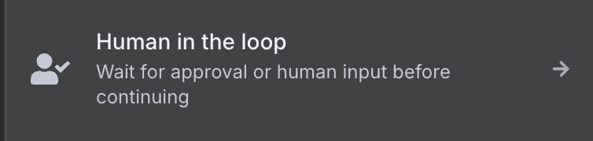
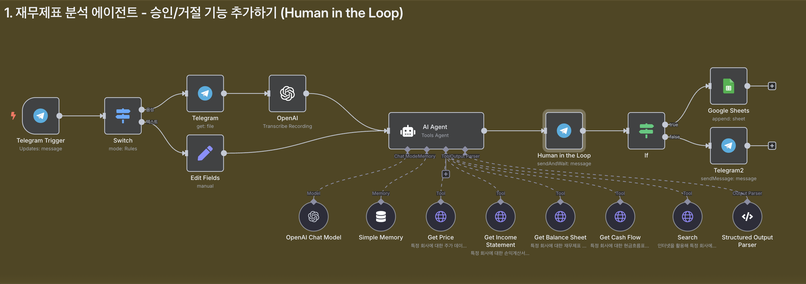

# n8n Human in the Loop 가이드



n8n에서 AI가 생성한 결과물을 사람이 직접 확인하고 승인하는 Human in the Loop 시스템 구축 가이드입니다. 업무에서 실질적으로 AI 자동화를 활용할 때 필수적인 검토 과정을 자동화 워크플로우에 통합하는 방법을 알아봅니다.

## 목차

- [Human in the Loop 개요](#human-in-the-loop-개요)
- [사전 준비사항](#사전-준비사항)
- [승인/거절 버튼 방식](#승인거절-버튼-방식)
  - [재무분석 에이전트에 적용하기](#재무분석-에이전트에-적용하기)
  - [워크플로우 구성](#워크플로우-구성)
  - [테스트 및 실행](#테스트-및-실행)
- [텍스트 피드백 방식](#텍스트-피드백-방식)
  - [리서치 에이전트에 적용하기](#리서치-에이전트에-적용하기)
  - [피드백 분류 시스템](#피드백-분류-시스템)
  - [반복 피드백 루프 구성](#반복-피드백-루프-구성)
- [실제 사용 예시](#실제-사용-예시)
- [활용 팁](#활용-팁)

## Human in the Loop 개요

Human in the Loop은 자동화 워크플로우에서 사람이 중간에 개입하여 의사결정을 내릴 수 있게 하는 시스템입니다. AI가 생성한 결과물을 100% 믿고 활용하기 어려운 상황에서 필수적인 검토 과정을 제공합니다.

### 두 가지 Human in the Loop 방식

1. **승인/거절 버튼 방식**
   - 간단한 이진 선택 (승인 또는 거절)
   - 승인 시에만 추가 작업 진행
   - 빠른 의사결정이 필요한 경우에 적합

2. **텍스트 피드백 방식**
   - 자유로운 텍스트 피드백 제공
   - 피드백 기반 결과물 수정
   - 반복적인 개선이 필요한 경우에 적합

### 활용 시나리오

- AI 생성 콘텐츠의 최종 검토
- 중요한 문서나 리포트 공유 전 승인
- 데이터 분석 결과의 정확성 확인
- SNS/블로그 포스팅 전 내용 검증

## 사전 준비사항

### 1. 기본 워크플로우 준비
- 기존에 구축된 AI 워크플로우 (재무분석, 리서치 등)
- 텔레그램 봇 설정 및 API 키
- 필요한 외부 서비스 연동 (Google Sheets, Slack 등)

### 2. 필요한 API 키
- OpenAI API 키 (ChatGPT 모델 사용)
- 텔레그램 Bot Token
- Google Sheets API (선택적)
- Slack API (선택적)

## 승인/거절 버튼 방식



### 재무분석 에이전트에 적용하기

기존의 재무분석 워크플로우에 승인/거절 기능을 추가하여 분석 결과를 Google Sheets에 저장할지 여부를 사용자가 결정할 수 있게 합니다.

### 워크플로우 구성

#### 1. 텔레그램 Human in the Loop 노드 설정

기존 'Send Message' 노드를 'Human in the Loop' 노드로 교체합니다.

**노드 설정:**
- **Node Type**: Telegram > Human in the Loop
- **Response Type**: Approval
- **Approve Button Text**: ✅ 시트 업로드
- **Disapprove Button Text**: ❌ 드롭
- **Message**: AI 에이전트의 분석 결과

#### 2. 조건 분기 노드 추가

**If 노드 설정:**
- **Condition**: `{{ $json.data.approved }} is true`
- **True 경로**: Google Sheets 업로드
- **False 경로**: 거절 메시지 전송

#### 3. Google Sheets 업로드 노드 (승인 경로)

**Google Sheets 노드 설정:**
- **Operation**: Append Row
- **Document ID**: 대상 스프레드시트 ID
- **Sheet**: 업로드할 시트명
- **Values**: 
  ```
  날짜: {{ $now.format('yyyy-MM-dd') }}
  질문: {{ $('Telegram Trigger').item.json.message.text }}
  티커: {{ $('AI Agent').item.json.output.ticker }}
  제목: {{ $('AI Agent').item.json.output.subject }}
  본문: {{ $('AI Agent').item.json.output.text }}
  ```

#### 4. 거절 메시지 노드 (거절 경로)

**Telegram Send Message 노드 설정:**
- **Chat ID**: `{{ $('Telegram Trigger').item.json.message.chat.id }}`
- **Text**: "해당 분석 내용은 시트에 업데이트하지 않았습니다."

### 테스트 및 실행

1. **테스트 질문 전송**:
   ```
   테슬라의 최근 주가추이 변동과 그 원인을 알려줘
   ```

2. **결과 확인**:
   - AI 분석 결과와 함께 승인/거절 버튼이 표시됨
   - ✅ 시트 업로드 선택 시: Google Sheets에 데이터 저장
   - ❌ 드롭 선택 시: 거절 메시지만 전송

## 텍스트 피드백 방식


### 리서치 에이전트에 적용하기

리서치 결과에 대해 자유로운 텍스트 피드백을 제공하고, 피드백에 따라 결과를 수정하거나 Slack에 공유하는 시스템을 구축합니다.

- 리서치 에이전트 구성 방법 ([자세한 가이드 보기](./research-agent.md))

### 워크플로우 구성

#### 1. 텍스트 입력 Human in the Loop 노드

**Telegram 'Send and Wait for Response' 노드 설정:**
- **Response Type**: Free Text
- **Message**: AI 리서치 결과
- **Wait for Response**: 활성화

#### 2. 피드백 분류 시스템

**OpenAI Text Classifier 노드 설정:**

**승인 카테고리:**
```
사용자의 피드백이 전체적으로 긍정적이며, 추가 수정 없이 바로 슬랙 채널에 공유해도 된다는 의사를 나타냅니다. "좋습니다", "공유해주세요", "괜찮네요", "이대로 슬랙에 보내도 돼요" 등 승인을 직접적으로 또는 간접적으로 표현하는 문장이 포함된 경우입니다.

예시:
- "이 내용 괜찮네요. 슬랙에 공유해주세요."
- "좋습니다. 이대로 보내셔도 돼요."
- "전반적으로 만족합니다."
```

**재작성 카테고리:**
```
사용자의 피드백에 뉴스 내용에 대한 수정 요청, 기사 변경/추가 지시, 표현에 대한 불만 또는 부정적인 뉘앙스가 포함된 경우입니다. "다른 기사로 바꿔줘", "출처 없는 건 빼줘", "2개 더 추가해줘" 같은 작업 요청 또는 피드백이 포함된 경우 이 카테고리로 분류합니다.

예시:
- "출처 없는 기사 빼고 다시 보내줘요."
- "3번 뉴스는 너무 일반적이라 다른 걸로 바꿔줘."
- "2개 더 추가해줘."
```

#### 3. Slack 포맷터 (승인 경로)

**OpenAI Message Model 노드 설정:**

**시스템 프롬프트:**
```
당신은 Slack에 표시할 정보를 요약하고 포맷팅하는 전문 슬렉 포맷터입니다.

다음 조건에 따라 Slack Block Kit JSON 메시지 형식으로만 응답하세요:
- 사용자로부터 제공된 데이터 외에는 어떤 정보도 생성하지 마세요 (hallucination 금지).
- 요약 대상은 기사일 수도 있고 아닐 수도 있습니다. 어떤 정보든 동일하게 처리하세요.
- 제목(title)과 요약(summary)은 한국어로 번역하세요. 단, 링크(URL), 태그(tags), 날짜(date)는 원본 그대로 유지합니다.
- 날짜는 반드시 `YYYY-MM-DD` 형식으로 표기합니다.
- 각 정보 항목은 Slack Block Kit의 `section` 블록 하나로 구성되며, `blocks` 배열 안에 포함되어야 합니다.

각 항목은 다음 구성 요소를 포함해야 합니다:
- 제목: 굵게 처리 (예: *제목*)
- 날짜
- 태그: 쉼표로 구분된 문자열 또는 Slack 스타일 인라인 리스트
- 요약 (한국어)
- 클릭 가능한 링크

입력된 항목이 여러 개일 경우, 각 항목을 개별 `section` 블록으로 구성하고, 모두 하나의 `blocks` 배열에 포함하세요.

출력은 반드시 JSON의 `"blocks"` 배열 하나로만 구성되어야 하며, 그 외 텍스트는 포함하지 마세요.
```

**유저 프롬프트:**
```
다음은 요약 및 포맷이 필요한 다양한 정보들입니다.
전체 텍스트는 여기에 포함되어 있습니다:
{{ $('Edit Fields1').item.json.text }}

이 텍스트를 바탕으로 다음 규칙에 따라 Slack 메시지로 요약 및 포맷팅해주세요:

1. 각 정보 항목의 제목(title)과 요약(summary)을 한국어로 번역해주세요.
2. 요약은 **3~5줄 정도의 자연스러운 문장**으로 정리해주세요.
3. 날짜는 반드시 `YYYY-MM-DD` 형식으로 표기해주세요.
4. 태그는 쉼표로 구분된 문자열 또는 Slack 인라인 리스트 형태로 작성해주세요.
5. 각 정보 항목은 **Slack Block Kit의 section 블록 형식**으로 작성되며,
   전체 항목은 하나의 `"blocks"` 배열로 묶어야 합니다.

출력은 JSON 형식으로만 하고, 설명 문장이나 기타 텍스트는 포함하지 마세요.
```

#### 4. 수정 AI 에이전트 (재작성 경로)

**AI Agent 노드 설정:**

**시스템 프롬프트:**
```
너는 유능한 한국어 리서치 기반 요약 전문가 AI야.

사용자가 이전에 생성된 요약 결과에 피드백을 주었고,
너는 그 피드백을 반영하여 **기존 내용을 더 나은 형태로 재작성**해야 해.
필요하다면 Tavily 웹 검색 도구를 사용해서 최신 정보나 신뢰 가능한 데이터를 찾아야 하고,
그 정보에 근거해 **더 명확하고, 신뢰도 높은 요약을 생성**해야 해.

오늘 날짜는 {{ $today.format('yyyy-MM-dd') }}야.
사용자가 날짜 기준 피드백을 하면, 이 날짜를 기준으로 정보를 검색해야 해.

---

📌 전제 조건:

- 입력에는 항상 두 가지가 함께 제공될 거야:
  1. 기존 요약 결과 (예: 뉴스 3~5개, 일반 정보 요약 등)
  2. 사용자 피드백 (예: "출처 없는 기사 제외해주세요", "2개 더 추가해주세요")

- 요약 대상은 뉴스일 수도 있고 아닐 수도 있어.
- 피드백이 지적한 내용을 반드시 반영해야 해 (예: 기사 교체, 개수 추가, 표현 수정 등)

---

🧠 답변할 때는 반드시 다음을 지켜:

1. **검증 가능한 최신 정보**를 바탕으로 요약할 것
2. **모호한 표현, 출처 불명 정보는 제거**하거나 **신뢰 가능한 정보로 교체**
3. 필요시 Tavily 툴을 활용하여 **최신 내용을 검색 및 보강**
4. **불릿 포인트 또는 단락 형태로 간결하고 논리적으로 서술**

---

📝 출력 형식은 다음과 같아:

- 각 항목은 다음 구성 요소를 포함해줘:
  - **제목** (굵게 또는 강조된 한 줄 제목)
  - **요약 내용** (3~5줄)
  - **날짜 (YYYY-MM-DD 형식)** – 가능할 경우만
  - **관련 태그** (가능할 경우만)
  - **출처 URL** – 검색한 정보가 있을 경우

- 마지막에는 **출처 섹션**을 따로 정리해줘
  예시:
  출처: https://example.com/...
  출처 없음

---

🚫 절대 하지 말아야 할 것:

- 사용자의 피드백을 무시하고 기존 내용을 그대로 재사용하는 것 ❌
- 출처 없이 정보를 새로 만들어내거나 지어내는 것 ❌
- 무의미한 요약 반복 ❌

---

너의 목표는:
**기존 요약과 피드백을 반영하여, 더 정확하고 신뢰할 수 있는 요약 결과를 새로 만들어주는 것**이야.
```

**유저 프롬프트:**
```
기존 답변: {{ $('Edit Fields1').item.json.text }}
피드백: {{ $json.data.text }}
```

### 반복 피드백 루프 구성

#### 1. Edit Fields 노드 추가

수정된 결과를 다시 텔레그램으로 보내기 위해 필드값을 통일합니다.

**Edit Fields 노드 설정:**
- **Field Name**: text
- **Field Value**: {{ $json.output }}

#### 2. 루프 연결

수정 AI 에이전트의 출력을 다시 텔레그램 Human in the Loop 노드로 연결하여 반복적인 피드백이 가능하도록 합니다.

**연결 방식:**
```
수정 AI 에이전트 → Edit Fields → 텔레그램 Human in the Loop
```

#### 3. Slack 메시지 전송

최종 승인된 내용을 Slack 채널로 전송합니다.

**Slack 노드 설정:**
- **Channel**: 대상 채널 선택
- **Message Type**: Blocks
- **Blocks**: `{{ $('slack-formatter').item.json.blocks }}`

## 실제 사용 예시

### 승인/거절 버튼 방식 예시

1. **질문 전송**:
   ```
   테슬라의 최근 주가추이 변동과 그 원인을 알려줘
   ```

2. **AI 분석 결과 수신**:
   - 상세한 재무 분석 내용
   - ✅ 시트 업로드 / ❌ 드롭 버튼 표시

3. **사용자 선택**:
   - 승인: Google Sheets에 분석 결과 저장
   - 거절: "시트에 업데이트하지 않았습니다" 메시지

### 텍스트 피드백 방식 예시

1. **질문 전송**:
   ```
   최신 AI 뉴스 3개를 알려줘
   ```

2. **AI 리서치 결과 수신**:
   - 3개의 AI 관련 뉴스 요약

3. **피드백 제공**:
   ```
   기사를 2개 더 추가해줘
   ```

4. **수정된 결과 수신**:
   - 5개의 AI 관련 뉴스 요약

5. **최종 승인**:
   ```
   슬랙 전송해줘
   ```

6. **Slack 전송 완료**:
   - 포맷팅된 뉴스 요약이 Slack 채널에 전송

## 활용 팁

### 1. 효과적인 피드백 카테고리 설정

**명확한 구분 기준 제시:**
- 승인: "좋습니다", "공유해주세요", "괜찮네요"
- 수정: "더 추가해줘", "다른 걸로 바꿔줘", "출처 없는 건 빼줘"

**예시 문장 충분히 제공:**
- 각 카테고리별로 5개 이상의 예시 문장 포함
- 긍정/부정 표현의 다양한 형태 반영

### 2. 반복 루프 최적화

**무한 루프 방지:**
- 최대 반복 횟수 제한 설정
- 타임아웃 기능 활용

**메모리 관리:**
- 대화 히스토리를 적절히 관리
- 불필요한 데이터 정리

### 3. 다양한 분야에 적용

**콘텐츠 제작:**
- 블로그 포스트 작성 → 검토 → 발행
- SNS 콘텐츠 생성 → 승인 → 업로드

**업무 자동화:**
- 기사 요약 → 검토 → 공유
- 보고서 생성 → 검토 → 공유

**데이터 분석:**
- 분석 결과 생성 → 검증 → 보고서 저장

---

Human in the Loop 기능을 활용하면 AI 자동화의 편리함과 사람의 판단력을 효과적으로 결합할 수 있습니다. 이를 통해 더욱 신뢰할 수 있고 실용적인 자동화 시스템을 구축할 수 있으며, 업무 효율성과 품질을 동시에 향상시킬 수 있습니다.
