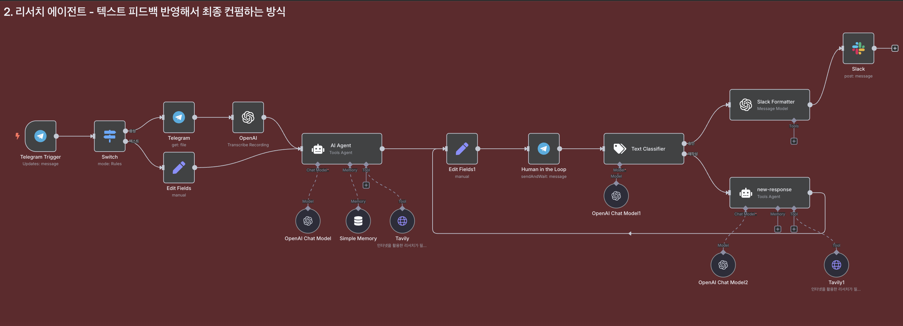

# n8n 리서치 AI 에이전트 구축 가이드



n8n을 활용하여 텔레그램을 통해 음성 및 텍스트로 질문을 받고, Tavily API를 사용해 웹 리서치를 수행하는 AI 에이전트 구축 가이드입니다. 최신 정보 검색과 신뢰할 수 있는 출처 제공을 통해 정확한 리서치 결과를 얻을 수 있습니다.

## 목차

- [리서치 에이전트 개요](#리서치-에이전트-개요)
- [사전 준비사항](#사전-준비사항)
- [워크플로우 구성](#워크플로우-구성)
  - [1. 텔레그램 트리거 설정](#1-텔레그램-트리거-설정)
  - [2. 입력 타입 분류](#2-입력-타입-분류)
  - [3. 음성 처리 경로](#3-음성-처리-경로)
  - [4. 텍스트 처리 경로](#4-텍스트-처리-경로)
  - [5. AI 리서치 에이전트 설정](#5-ai-리서치-에이전트-설정)
  - [6. Tavily 리서치 툴 설정](#6-tavily-리서치-툴-설정)
  - [7. 결과 전송](#7-결과-전송)
- [테스트 및 사용법](#테스트-및-사용법)
- [커스터마이징 가이드](#커스터마이징-가이드)

## 리서치 에이전트 개요

이 리서치 AI 에이전트는 다음과 같은 기능을 제공합니다:

### 주요 기능
- **다중 입력 지원**: 텍스트 메시지와 음성 메시지 모두 처리
- **웹 리서치**: Tavily API를 통한 실시간 인터넷 검색
- **신뢰성 있는 정보**: 검증 가능한 출처와 함께 정보 제공
- **대화 맥락 유지**: 채팅별 메모리 기능으로 연속적인 대화 가능
- **한국어 최적화**: 한국어 질문에 대한 정확한 답변

### 워크플로우 구조
```
텔레그램 입력 → 타입 분류 → 음성/텍스트 처리 → AI 에이전트 → 리서치 수행 → 결과 전송
```

## 사전 준비사항

### 1. 필수 API 키
- **텔레그램 Bot Token**: BotFather에서 봇 생성 후 토큰 발급
- **OpenAI API Key**: ChatGPT 모델 사용을 위한 API 키
- **Tavily API Key**: 웹 리서치를 위한 Tavily 서비스 API 키

### 2. 서비스 가입 및 설정
- [Tavily](https://tavily.com/) 계정 생성 및 API 키 발급
- [OpenAI Platform](https://platform.openai.com/) 계정 설정
- 텔레그램 봇 생성 및 설정

### 3. n8n 환경
- n8n 설치 및 실행 상태
- 필요한 노드들이 사용 가능한 상태

## 워크플로우 구성

### 1. 텔레그램 트리거 설정

**Telegram Trigger 노드 추가**
- **Node Type**: Telegram > On Message
- **Bot Token**: 텔레그램 봇 토큰 입력
- **Updates**: 모든 메시지 수신으로 설정

### 2. 입력 타입 분류

**Switch 노드 설정**

음성 메시지와 텍스트 메시지를 구분하여 각각 다른 경로로 처리합니다.

**Rule 1 - 음성 처리:**
- **Condition**: `{{ $json.message.voice.mime_type }} contains audio`
- **Output Name**: `음성`

**Rule 2 - 텍스트 처리:**
- **Condition**: `{{ $json.message.text }} exists`
- **Output Name**: `텍스트`

### 3. 음성 처리 경로

#### 3.1 텔레그램 파일 다운로드

**Telegram Get File 노드 설정**
- **File ID**: `{{ $json.message.voice.file_id }}`
- **Operation**: Get File

#### 3.2 음성을 텍스트로 변환

**OpenAI Transcribe Recording 노드 설정**
- **Operation**: Transcribe a Recording
- **Input Data Field Name**: `data`

### 4. 텍스트 처리 경로

**Edit Fields 노드 설정**

텍스트 메시지를 표준화된 형태로 변환합니다.

- **Operation**: Add Field
- **Field Name**: `text`
- **Field Type**: String
- **Field Value**: `{{ $json.message.text }}`

**목적**: 음성과 텍스트 모두 `json.text` 형태로 통일하여 AI 에이전트에서 동일하게 처리

### 5. AI 리서치 에이전트 설정

**AI Agent 노드 설정**

#### 5.1 기본 설정
- **Chat Model**: OpenAI > ChatGPT
- **Model**: gpt-4.1 (또는 gpt-4o)
- **User Message**: `{{ $json.text }}`

#### 5.2 메모리 설정
- **Memory Type**: Simple Memory
- **Session ID Key**: `{{ $('Switch').item.json.message.chat.id }}`
- **Context Window Length**: 10

#### 5.3 시스템 프롬프트

```
너는 똑똑하고 유능한 AI 리서치 어시스턴트야.

나는 한국어로 질문할 거고, 너는 그에 대해 필요시 "Tavily" 툴을 활용해 웹 리서치를 수행하고,
신뢰할 수 있는 최신 정보를 바탕으로 정확하고 심층적인 답변을 해줘야 해.

오늘 날짜는 {{ $today.format('yyyy-MM-dd') }}야.
사용자가 날짜 기준 질문을 하면, 이 날짜를 기준으로 정보를 검색해야 해.

---

🧠 답변할 때는 반드시 다음을 지켜:

1. **검증 가능한 정보를 바탕으로 답변할 것**
2. **명확하고 논리적으로 설명할 것**
3. **모든 주요 주장이나 정보에는 웹 검색을 진행했다면 출처 링크(URL)를 반드시 포함할 것**
   - 출처는 신뢰할 수 있는 웹사이트여야 하며, 가능한 한 최신 정보여야 해
   - 출처가 없는 경우 "출처 없음"이라고 명확히 밝혀줘
   - 절대로 출처를 지어내거나 가짜로 만들지 마

---

📝 답변 형식은 아래와 같이 통일해:

- 핵심 내용은 **필요시 불릿 포인트로 요약**
- 각 주장이나 사실 옆에 **직접 관련된 출처 링크(URL)**를 함께 포함
- 마지막에는 **"출처" 섹션**을 따로 만들어, 관련 URL들을 한 번 더 정리해
  예시:
  출처: https://example.com/...
  출처(공식 블로그): https://openai.com/blog/...
  출처 없음

---

🚫 아래는 절대로 하지 마:
- 추측, 감정 표현, 개인 의견 포함 ❌
- 근거 없는 일반화 ❌
- 출처가 불분명한 콘텐츠 사용 ❌

---

✔️ 너의 목표는:
"최신, 신뢰 가능한 정보를 기반으로 한 명확하고 실용적인 리서치 요약을 제공하는 것"이야.
```

### 6. Tavily 리서치 툴 설정

AI 에이전트에 Tavily 웹 검색 도구를 추가합니다.

#### 6.1 HTTP Request 노드 설정

**기본 설정:**
- **Description**: `인터넷을 활용한 리서치가 필요할때 사용하여, 필요한 정보를 수집합니다.`
- **Method**: POST
- **URL**: `https://api.tavily.com/search`

#### 6.2 인증 설정

**Authentication:**
- **Type**: Header Auth
- **Header Name**: Authorization
- **Header Value**: `Bearer [YOUR_TAVILY_API_KEY]`

#### 6.3 헤더 설정

**Send Headers 활성화:**
- **Name**: Content-Type
- **Value**: application/json

#### 6.4 요청 본문 설정

**Body 활성화 (JSON 형태):**
```json
{
  "query": "{{$fromAI('query','search term')}}",
  "topic": "{{$fromAI('topic','The category of search. The value should be either 'general' or 'news'')}}",
  "search_depth": "advanced",
  "chunks_per_source": 3,
  "max_results": 3,
  "time_range": null,
  "days": 7,
  "include_answer": false,
  "include_raw_content": false,
  "include_images": true,
  "include_image_descriptions": false,
  "include_domains": [],
  "exclude_domains": []
}
```

#### 6.5 매개변수 설명

- **query**: AI가 결정하는 검색어
- **topic**: 검색 카테고리 (general 또는 news)
- **search_depth**: 검색 깊이 (basic/advanced)
- **max_results**: 최대 검색 결과 수 (3-10 권장)
- **days**: 최근 며칠간의 정보만 검색 (뉴스 검색 시)
- **chunks_per_source**: 각 소스당 추출할 정보 청크 수

### 7. 결과 전송

**Telegram Send Message 노드 설정**
- **Chat ID**: `{{ $('Telegram Trigger').item.json.message.chat.id }}`
- **Text**: `{{ $('AI Agent').item.json.output }}`

## 테스트 및 사용법

### 1. 워크플로우 활성화
1. 모든 노드 연결 확인
2. 워크플로우 저장 및 활성화
3. 텔레그램 봇과 대화 시작

### 2. 텍스트 질문 예시
```
최신 AI 뉴스 3개를 알려줘
```

```
2025년 한국의 전기차 보조금 정책이 어떻게 바뀌었어?
```

```
ChatGPT와 Claude의 차이점을 비교해줘
```

### 3. 음성 질문 예시
텔레그램에서 음성 메시지로 동일한 질문들을 보낼 수 있습니다.

### 4. 예상 응답 형태
```
🔍 2025년 최신 AI 뉴스 요약

**1. OpenAI GPT-4.1 모델 출시**
- 새로운 성능 개선과 안전성 강화
- 출처: https://openai.com/blog/gpt-4-1-release

**2. 구글 Gemini Pro 업데이트**
- 멀티모달 기능 대폭 개선
- 출처: https://blog.google/technology/ai/gemini-pro-update

**3. 마이크로소프트 AI 파트너십 확대**
- 기업용 AI 솔루션 강화
- 출처: https://news.microsoft.com/ai-partnership

---
출처:
- https://openai.com/blog/gpt-4-1-release
- https://blog.google/technology/ai/gemini-pro-update
- https://news.microsoft.com/ai-partnership
```

## 커스터마이징 가이드

### 1. 시스템 프롬프트 수정

업무나 목적에 맞게 시스템 프롬프트를 수정할 수 있습니다:

**학술 연구용:**
```
너는 학술 연구 전문 AI 어시스턴트야. 
논문, 학술지, 공식 연구 기관의 자료만을 우선적으로 참고하고,
인용 형식을 APA 스타일로 제공해줘.
```

**비즈니스 분석용:**
```
너는 비즈니스 인텔리전스 전문 AI야.
시장 동향, 기업 분석, 산업 리포트 위주로 정보를 수집하고,
비즈니스 임팩트를 중심으로 요약해줘.
```

**뉴스 모니터링용:**
```
너는 뉴스 큐레이션 전문 AI야.
최신 뉴스만을 대상으로 하고, 중요도와 신뢰도를 평가하여
핵심 뉴스만 선별해서 브리핑 형태로 제공해줘.
```

### 2. Tavily 검색 매개변수 조정

**더 많은 결과가 필요한 경우:**
```json
{
  "max_results": 5,
  "chunks_per_source": 5
}
```

**최신 뉴스 중심 검색:**
```json
{
  "topic": "news",
  "days": 3,
  "time_range": "week"
}
```

**특정 도메인 포함/제외:**
```json
{
  "include_domains": ["reddit.com", "stackoverflow.com"],
  "exclude_domains": ["example-spam-site.com"]
}
```

---

이 리서치 AI 에이전트를 통해 신뢰할 수 있는 최신 정보를 빠르게 얻을 수 있으며, Human in the Loop 기능과 결합하여 더욱 정확하고 유용한 정보 관리 시스템을 구축할 수 있습니다.