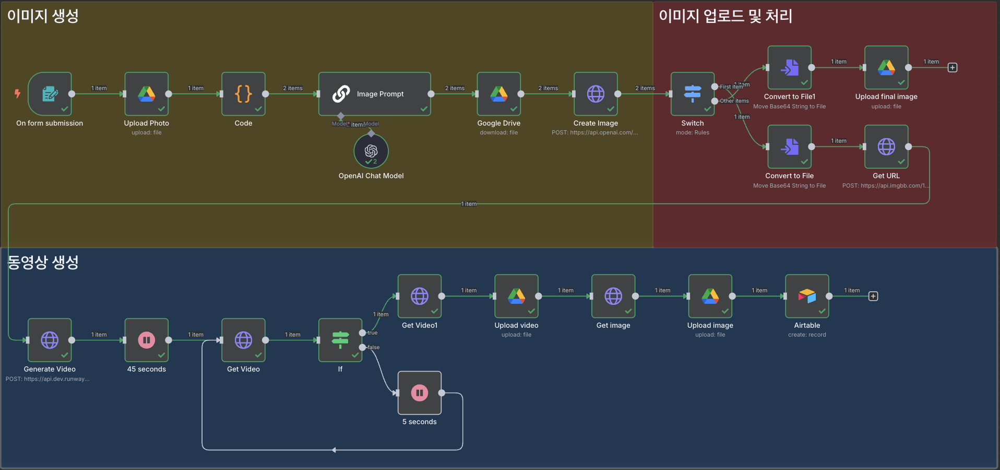

# n8n으로 AI 상품 이미지 및 영상 자동 제작 시스템 구축 가이드


n8n을 활용하여 상품 상세페이지용 이미지와 영상을 자동으로 생성하는 AI 시스템 구축 가이드입니다. 간단한 폼 입력만으로 전문적인 상품 콘텐츠를 1-2분 내에 제작할 수 있습니다.

## 📋 목차

- [시스템 개요](#시스템-개요)
- [사전 준비사항](#사전-준비사항)
- [워크플로우 구축 단계](#워크플로우-구축-단계)
  - [1. 정보 입력 폼 설정](#1-정보-입력-폼-설정)
  - [2. 이미지 업로드 및 저장](#2-이미지-업로드-및-저장)
  - [3. 데이터 분할 처리](#3-데이터-분할-처리)
  - [4. AI 이미지 프롬프트 생성](#4-ai-이미지-프롬프트-생성)
  - [5. ChatGPT 이미지 생성](#5-chatgpt-이미지-생성)
  - [6. 처리 방식 분기](#6-처리-방식-분기)
  - [7. Runway 영상 생성](#7-runway-영상-생성)
  - [8. 결과물 저장 및 관리](#8-결과물-저장-및-관리)
- [테스트 및 활용](#테스트-및-활용)
- [시스템 한계점](#시스템-한계점)
- [비용 고려사항](#비용-고려사항)
- [문제 해결](#문제-해결)

## 시스템 개요



이 시스템은 다음과 같은 구조로 작동합니다:

1. **폼 입력**: 제품 이미지, 이름, 설명, 촬영 각도 정보 수집
2. **AI 이미지 생성**: ChatGPT를 활용한 고품질 상품 이미지 생성
3. **영상 생성**: Runway를 통한 3D 회전 영상 제작
4. **자동 저장**: Google Drive 업로드 및 Airtable 아카이브
5. **결과 관리**: 생성된 모든 자료의 체계적 정리

### 주요 기능
- 다양한 각도(정면, 뒷면, 좌측면, 우측면)의 상품 이미지 생성
- 첫 번째 이미지를 활용한 프리미엄 회전 영상 제작
- 모든 결과물의 자동 분류 및 저장
- 메타데이터 기반 체계적 관리

## 사전 준비사항

### 1. API 키 발급
- **OpenAI API 키**: [platform.openai.com](https://platform.openai.com)에서 발급
- **Runway API 키**: [dev.runwayml.com](https://dev.runwayml.com)에서 발급
- **ImgBB API 키**: [api.imgbb.com](https://api.imgbb.com)에서 발급 (이미지 URL 변환용)

### 2. 서비스 계정 준비
- **Google Drive**: 이미지/영상 저장용
- **Airtable**: 메타데이터 관리용 (무료 플랜 1,000행까지 지원)

### 3. 폴더 구조 설정
Google Drive에 다음 폴더들을 미리 생성해두세요:
- `product_image`: 상품 이미지 저장용
- `product_video`: 상품 영상 저장용

## 워크플로우 구축 단계

### 1. 정보 입력 폼 설정

**Form 트리거 노드 추가**

```
- Form Title: 상세페이지 콘텐츠 제작 Form
- Form Description: 생성하고 싶은 상세페이지 이미지, 영상에 대한 정보를 기입해주시면, 이미지와 영상을 제작해드립니다.
```

**Form Elements 설정**

1. **Product Image** (File Type)
   - Required Field: ✓
   - Accepted File Types: `.jpg, .png`
   - Description: 제품 레퍼런스 이미지

2. **Product Name** (Text Type)
   - Required Field: ✓
   - Placeholder: "제품명을 기입해주세요"

3. **Product Description** (Text Type)
   - Required Field: ✓
   - Placeholder: "제품 설명을 기입해주세요"

4. **Product Image View** (Dropdown List)
   - Required Field: ✓
   - Multiple Choice: ✓
   - Options: 정면, 뒷면, 좌측면, 우측면

**추가 설정**
- "Append n8n attribution" 옵션 해제

### 2. 이미지 업로드 및 저장

**Google Drive Upload File 노드**

```
- Input Data Field Name: Product_Image
- File Name: {{ $json['Product Name'] }}_first_image
- Parent Folder: product_image (미리 생성한 폴더)
```

### 3. 데이터 분할 처리

**Code 노드 추가**

선택한 촬영 각도 수만큼 아이템을 분할하여 각각 이미지를 생성할 수 있도록 데이터를 처리합니다.

```javascript
const views = $('On form submission').first().json['Product Image View']
const total = views.length;

return views.map((v, index) => {
  return {
    json: {
      item_index: index + 1,
      total_count: total,       
      view: v,
      product_name: $('On form submission').first().json['Product Name'],
      product_description: $('On form submission').first().json['Product Description'],
    }
  };
});
```

### 4. AI 이미지 프롬프트 생성

**Basic LLM Chain 노드 설정**

**System Prompt:**
```
You are an expert product photo prompt engineer and a fluent Korean-English translator.

## Objective:
You will receive a product name, description, and specified product angle written in Korean.

Your task is to:
1. **Accurately translate** the product name, description, and viewing angle from Korean to fluent, natural English.
2. **Generate a single English image prompt**, optimized for AI models like gpt-image-1 or Midjourney, that produces a clean, hyper-realistic product photo suitable for **professional advertising or e-commerce use**.

## Output Rules:
- Output **only one complete English prompt**.
- Format the prompt as if giving a direction for a product photo shoot.
- Do **NOT** include any extra explanation or translation — just the final image prompt.
- The prompt **must describe**:
  - The translated product description and features
  - The specified product angle (e.g., front view, back view, left-side view)
  - Keywords like:
    - "hyper-realistic"
    - "softbox lighting"
    - "studio background"
    - "sharp focus"
    - "minimalistic composition"
    - "premium advertising quality"
- Ensure the image focuses **only on the product**:
  - No human hands, no props, no text, no added elements
  - Do not infer any unseen features or alter the product's original design

## Example Input (Korean):
제품 이름: 프리미엄 무광 블루투스 스피커  
제품 설명: 실린더형 디자인과 매끄러운 금속 마감  
제품 각도: 좌측면

## Example Output (English):
"Hyper-realistic studio photo of a premium matte black cylindrical Bluetooth speaker with smooth metal finish, left-side view, centered on a clean white background with softbox lighting and natural shadows, sharp focus, minimalistic composition, no human hands or props, product-only, and premium advertising style."
```

**User Prompt:**
```
제품 이름: {{ $('Code').item.json.product_name }}  
제품 설명: {{ $('On form submission').item.json['Product Description'] }}  
제품 각도: {{ $('Code').item.json.view }}
```

### 5. ChatGPT 이미지 생성

**Google Drive Download File 노드**
```
- By ID: {{ $('Upload Photo').item.json.id }}
```

**HTTP Request 노드 (Create Image)**

ChatGPT의 이미지 편집 기능을 활용하여 레퍼런스 이미지를 개선합니다.

```
- Method: POST
- URL: https://api.openai.com/v1/images/edits
- Authentication: Header Auth
  - Name: Authorization
  - Value: Bearer YOUR_OPENAI_API_KEY
```

**Body (Form-Data):**
```
- model: gpt-image-1
- prompt: {{ $('Image Prompt').item.json.text }}
- image: data (n8n Binary File)
```

### 6. 처리 방식 분기

**Switch 노드 설정**

첫 번째 이미지는 영상 제작에 활용하고, 나머지는 이미지만 저장하도록 분기 처리합니다.

```
Rule 1: {{ $('Code').item.json.item_index }} is equal to 1 → First item
Rule 2: {{ $('Code').item.json.item_index }} is not equal to 1 → Other items
```

#### Other Items 처리 (이미지만 저장)

**Convert to File 노드:**
```
- Input: data[0].b64_json
- Output: data_{{ $('Code').item.json.item_index }}
```

**Google Drive Upload File 노드:**
```
- Input Name: data_{{ $('Code').item.json.item_index }}
- File Name: {{ $('Code').item.json.product_name }}-{{ $('Code').item.json.view }}
- Parent Folder: product_image
```

#### First Item 처리 (영상 제작)

**Convert to File 노드:**
```
- Input Field: data[0].b64_json
- Output Field: data_{{ $('Code').item.json.item_index }}
```

**HTTP Request 노드 (Get URL) - ImgBB 활용**

Runway API가 URL 형태의 이미지를 요구하므로 변환이 필요합니다.

```
- Method: POST
- URL: https://api.imgbb.com/1/upload
- Authentication: Query Auth
  - Name: key
  - Value: YOUR_IMGBB_API_KEY
```

**Body (n8n Binary File):**
```
- image: data_1
```

### 7. Runway 영상 생성

**HTTP Request 노드 (Generate Video)**

```
- Method: POST
- URL: https://api.dev.runwayml.com/v1/image_to_video
- Authentication: Header Auth
  - Name: Authorization
  - Value: Bearer YOUR_RUNWAY_API_KEY
```

**Headers:**
```
- X-Runway-Version: 2024-11-06
```

**Body (JSON):**
```json
{
  "model": "gen4_turbo",
  "promptImage": "{{ $json.data.url }}",
  "duration": 10,
  "ratio": "960:960",
  "promptText": "Create a high-end marketing video using the provided product image. Simulate a slow, realistic 3D-style horizontal rotation around the product, as if on a premium turntable. The product must stay perfectly centered, with its full shape and edges visible at all times. Use a fixed, wide camera framing to avoid cropping or cutting off any part of the object. No zooming, vertical movement, camera cuts, or transitions. Do not hallucinate and create unseen images, and maintain a clean, neutral background and soft, even studio lighting. Do not add reflections, effects. Focus on polished, minimal, and realistic presentation — ideal for luxury product pages or commercial showcases. The motion should feel subtle, professional, and cinematic — revealing the product's form without distortion"
}
```

#### 영상 생성 대기 및 상태 확인

**Wait 노드**: 45초 대기

**HTTP Request 노드 (Get Task Status)**
```
- Method: GET
- URL: https://api.dev.runwayml.com/v1/tasks/{{ $json.id }}
- Headers: X-Runway-Version: 2024-11-06
```

**IF 노드**: 상태 확인
```
- Condition: {{ $json.status }} equals "SUCCEEDED"
- True: 다음 단계로 진행
- False: 5초 대기 후 다시 상태 확인
```

### 8. 결과물 저장 및 관리

#### 영상 다운로드 및 저장

**HTTP Request 노드 (Get Video)**
```
- Method: GET
- URL: {{ $('Get Video').item.json.output[0] }}
```

**Google Drive Upload File 노드**
```
- File Name: {{ $('On form submission').item.json['Product Name'] }}-video
- Parent Folder: product_video
```

#### 첫 번째 이미지 저장

**HTTP Request 노드 (Get Image)**
```
- Method: GET
- URL: {{ $('Get URL').item.json.data.url }}
```

**Google Drive Upload File 노드**
```
- File Name: {{ $('Code').item.json.product_name }}-{{ $('Code').item.json.view }}
- Parent Folder: product_image
```

#### Airtable 메타데이터 관리

**Airtable 노드 설정**

데이터베이스 테이블 구조:
- Product Name: 제품명
- Video URL: Runway 영상 직접 링크
- Video File URL: Google Drive 영상 파일 링크
- Image URL: ImgBB 이미지 직접 링크
- Image File URL: Google Drive 이미지 파일 링크

```
- product-name: {{ $('Code').item.json.product_name }}
- video-url: {{ $('Get Video1').item.json.output[0] }}
- video-file-url: {{ $('Upload video').item.json.webViewLink }}
- image-url: {{ $('Get URL').item.json.data.url }}
- image-file-url: {{ $json.webViewLink }}
```

## 테스트 및 활용

### 테스트 예시

1. **스타벅스 텀블러**
   - 촬영 각도: 정면, 좌측면
   - 예상 결과: 2개의 이미지 + 1개의 회전 영상

2. **향수 제품**
   - 촬영 각도: 정면, 뒷면
   - 예상 결과: 2개의 이미지 + 1개의 회전 영상

### 활용 팁

1. **레퍼런스 이미지**: 깔끔하고 배경이 단순한 이미지 사용 권장
2. **제품 설명**: 구체적이고 명확한 특징 기술
3. **각도 선택**: 제품의 핵심 특징이 잘 드러나는 각도 우선 선택

## 시스템 한계점

### 1. AI 환각(Hallucination) 현상
- **이미지 생성**: 존재하지 않는 텍스트나 디테일이 추가될 수 있음
- **해결책**: 레퍼런스 이미지 품질 개선, 프롬프트 정교화

### 2. 영상 생성 제약
- **입력 제한**: Runway 최신 모델은 이미지 1개만 처리 가능
- **적합성**: 단순한 형태의 제품에 최적화됨
- **복잡한 제품**: 입체적으로 다른 면이 존재하는 제품은 부자연스러운 회전 영상 생성 가능 (복잡한 영상 타 모델 고려 필요)

### 3. 텍스트 처리 한계
- **글씨가 많은 제품**: 환각 현상 발생 확률 증가
- **권장사항**: 텍스트가 적은 제품 우선 활용

## 비용 고려사항

### API 사용 비용 (대략적 추정)
- **OpenAI Image Generation**: $0.02-0.04 per image
- **Runway Video Generation**: $0.50 per 10-second video
- **ImgBB**: 무료 (월 제한 있음)

### 비용 절약 팁
1. **테스트 최소화**: 완전한 워크플로우 구축 후 테스트
2. **조건부 실행**: 필요한 경우에만 영상 생성

## 문제 해결

### 자주 발생하는 문제

1. **API 연결 실패**
   - API 키 유효성 확인
   - 각 서비스의 사용 한도 확인

2. **이미지 생성 실패**
   - 레퍼런스 이미지 크기 및 형식 확인
   - 프롬프트 길이 제한 준수

3. **영상 생성 시간 초과**
   - Wait 시간 조정 (45초 → 60초)
   - 상태 확인 루프 구현

4. **파일 업로드 오류**
   - Google Drive 권한 설정 확인
   - 폴더 경로 정확성 검증

## 마무리

이 시스템을 통해 전문적인 상품 콘텐츠를 빠르고 효율적으로 제작할 수 있습니다. AI 기술의 한계를 인지하면서도 현재 가능한 범위에서 최적의 결과를 얻기 위해 지속적으로 프롬프트와 설정을 개선해 나가시기 바랍니다.

향후 AI 모델의 발전에 따라 더욱 완벽한 품질의 결과물을 동일한 시스템으로 생성할 수 있을 것으로 기대됩니다.

---

**참고 자료**
- [OpenAI API Documentation](https://platform.openai.com/docs)
- [Runway API Documentation](https://docs.dev.runwayml.com)
- [n8n 공식 문서](https://docs.n8n.io)
- [Airtable](https://airtable.com/)